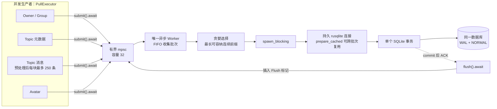
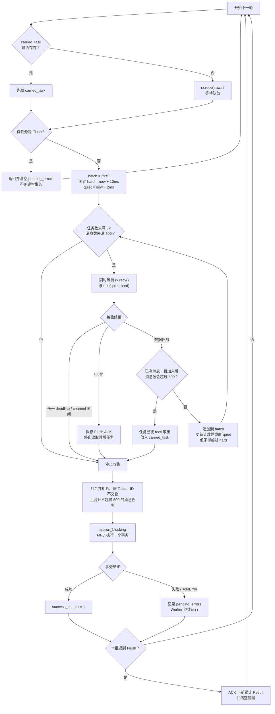
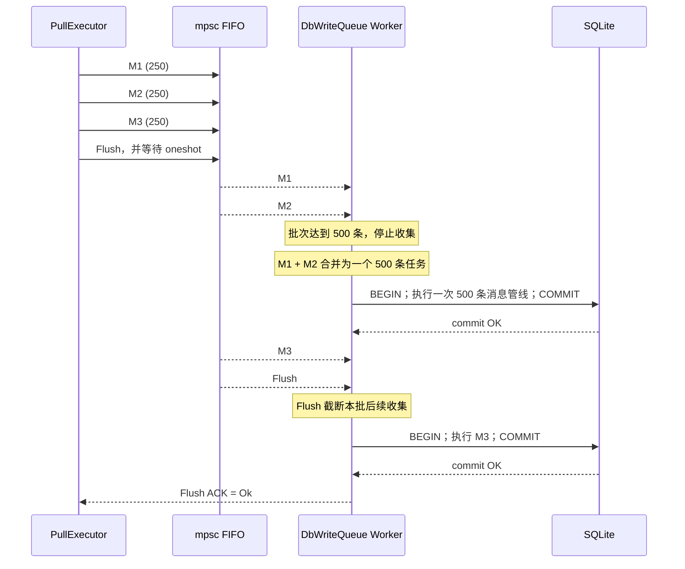
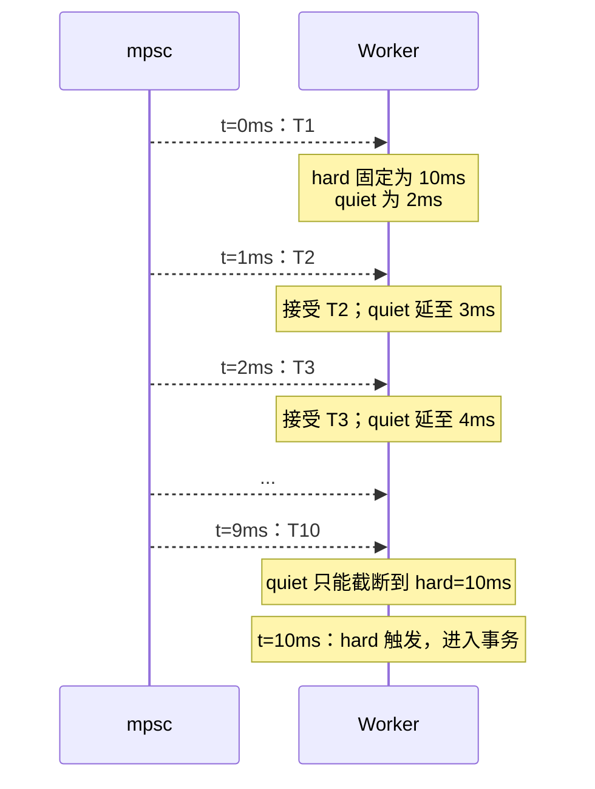
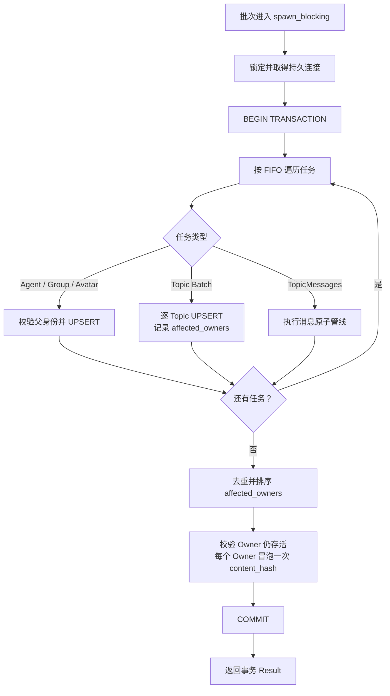
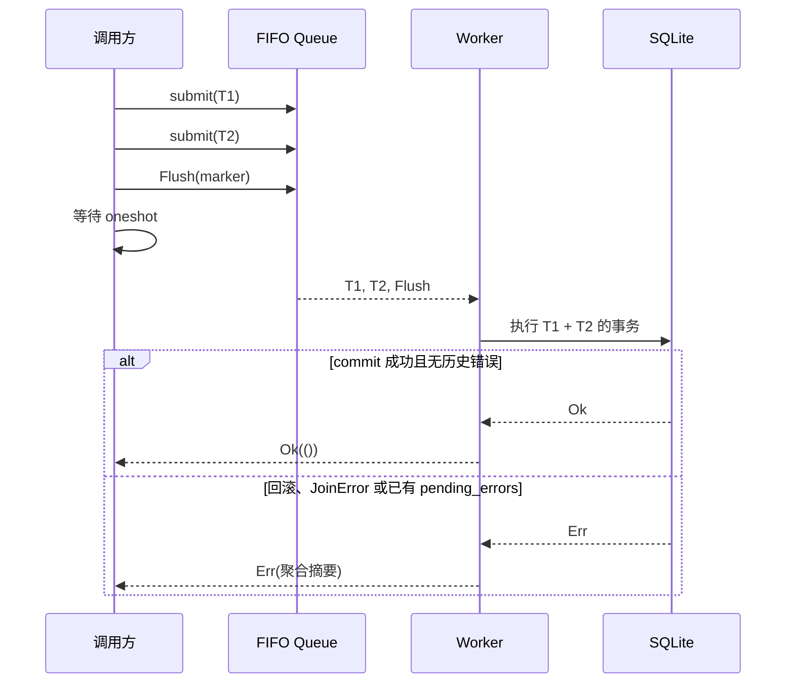
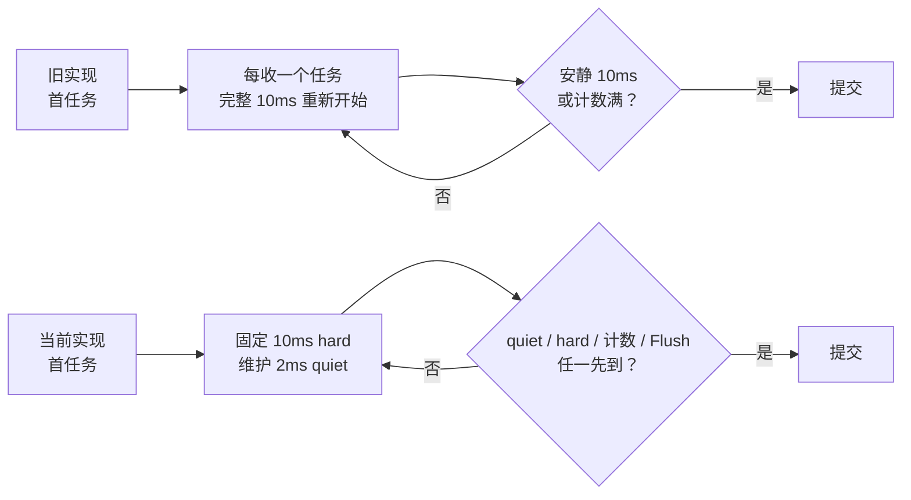

# 14_持久化层与数据访问（Persistence 领域总览）

## 1. 概述

### 1.1 领域定位

`persistence/` 是 VCP Mobile 重组后的 7 大领域目录之一，位于 `src-tauri/src/vcp_modules/persistence/`。该领域统管所有本地数据的持久化存储与访问，是前端 Vue 3 状态、Rust 核心业务逻辑与 SQLite 物理文件之间的唯一正式通道。

在 Double-Track 3-Tier 架构中，persistence/ 处于**底层数据轨道**的核心位置：
- 向上为 `chat/`、`agent/`、`sync/` 等领域提供类型安全的数据操作接口。
- 向下直接操作 SQLite 文件，通过 WAL 模式、批量事务、内存映射等手段将移动端磁盘 I/O 的延迟降至最低。
- 横向与 `infra/`（文件管理器）协作，完成附件元数据与物理文件的联合存储。

### 1.2 职责边界

| 模块 | 文件 | 核心职责 | 关键设计决策 |
|------|------|---------|-------------|
| 数据库管理器 | `db_manager.rs` | 连接池生命周期、Schema 初始化与迁移、PRAGMA 调优 | sqlx 异步连接池 (`max_connections=5`) + WAL 模式 |
| 写入队列 | `db_write_queue.rs` | 单工作线程批量写入、消除 SQLite 并发锁竞争、同步哈希冒泡 | mpsc 队列 + `spawn_blocking` + rusqlite 直连 |
| 消息仓储 | `message_repository.rs` | 消息读写、渲染编译、现有缓存刷新 | `MessageRenderCompiler` + 三段流水线 |

### 1.3 整体数据流

```text
Vue 3 前端 / Rust 业务层
    │
    ├─→ 普通查询（如加载话题列表、读取消息）
    │   ↓
    │   sqlx::Pool<Sqlite>（DbState.pool）
    │   ↓
    │   直接返回结果
    │
    └─→ 写入/同步（如收到同步消息、创建话题）
        ↓
        DbWriteQueue.submit(DbWriteTask::TopicMessages { ... })
        ↓
        mpsc::channel(32) → 单 Worker
        ↓
        spawn_blocking → 复用持久 rusqlite::Connection
        ↓
        FIFO 批量事务 → 按任务更新哈希或留给 Finalizer → 提交
```

**为什么查询与写入走不同通道？**
- 查询需要高并发、低延迟、异步友好 → sqlx 连接池是最佳选择。
- 写入在 SQLite 上天然串行（即使 WAL 模式，写操作仍需 `WAL_WRITE_LOCK`）。同步 Pull 若直接并发写入，会放大 `BUSY` 错误和重试。
- 写入队列将同步 Pull 请求收敛为单消费者顺序批量事务；其他 sqlx 写路径仍共享数据库，并由 2 秒 busy timeout 有界协调。

---

## 2. 数据库管理器（`db_manager.rs`）

`db_manager.rs`（约 740 行）是 persistence/ 领域的入口模块，负责 SQLite 数据库的初始化、连接池配置、**基于 sqlx 迁移引擎的版本化 Schema 管理**、页面大小优化与损坏自愈。

### 2.1 DbState

```rust
pub struct DbState {
    pub pool: Pool<Sqlite>,
    pub path: std::path::PathBuf,
}
```

| 字段 | 类型 | 说明 |
|------|------|------|
| `pool` | `Pool<Sqlite>` | sqlx 异步连接池，供全应用普通查询使用 |
| `path` | `PathBuf` | 数据库文件的绝对物理路径，供 `DbWriteQueue` 直接打开 rusqlite 连接 |

`DbState` 以 Tauri `State` 形式挂载到 `AppHandle`，通过 `app_handle.state::<DbState>()` 在任意 Tauri Command 中获取（L6–L9）。

### 2.2 连接池初始化

```rust
pub async fn init_db(app_handle: &AppHandle) -> Result<(Pool<Sqlite>, PathBuf), String>
```

**流程**（L11–L64）：

1. **路径解析**：通过 `app_handle.path().app_config_dir()` 获取配置目录，追加 `vcp_avatar.db`（L26–L39）。在 Android 上，该路径通常为 `/data/user/0/com.vcp.avatar/files/vcp_avatar.db`。
2. **连接选项配置**（L44–L65）：链式配置 SQLite PRAGMA。
3. **连接池创建**：`SqlitePoolOptions::new().max_connections(5).connect_with(...)`（L67）。
4. **运行版本化迁移**：调用 `run_migrations(&pool).await?`（L85），由 `sqlx::migrate!("./migrations")` 应用 `src-tauri/migrations/` 下的全部 SQL 迁移。
5. **返回**：`(pool, db_path)`，由调用方（`lib.rs` 生命周期管理器）组装为 `DbState` 并挂载到 App State。

### 2.3 损坏检测与恢复单元

数据库自愈遵循 fail-closed 边界，不能把任意 open/check 错误解释为损坏：

1. 在任何 SQLite open 之前检查文件集合。主 DB 缺失但 `-wal` 或 `-shm` 任一存在时，立即停止初始化并保留现场；不得让 `create_if_missing` 先创建空主库、间接清掉旁车；
2. `PRAGMA quick_check(1)` 只有返回非 `ok`，或错误码 primary code 为 `SQLITE_CORRUPT(11)` / `SQLITE_NOTADB(26)` 时，才授权恢复；BUSY、LOCKED、IOERR 等全部归类为“暂不可用”，不重建；
3. 已确认损坏时先关闭连接池，再把主 DB、WAL、SHM 移入同一个唯一恢复目录。普通 rename 失败会反向回滚此前移动，不删除任何旁车；
4. 归档成功后才创建干净数据库。恢复通知及 archive path 保存在 `LifecycleState.database_recovery`，并通过 `get_system_snapshot` 交给前端持久警告，避免启动早期一次性事件丢失。

这套流程保证常规错误路径不会静默丢弃最近已提交但尚未 checkpoint 的 WAL。三文件 rename 仍不是掉电原子操作；遇到异常断电留下的不完整恢复单元必须人工保全处理，不能自动猜测。

### 2.4 WAL 模式与深度性能调优

连接选项通过链式 `pragma` 调用实现 9 项深度优化（`db_manager.rs:56-65`）：

| PRAGMA | 设置值 | 作用 |
|--------|--------|------|
| `journal_mode` | `WAL` | 启用 Write-Ahead Logging，允许读操作与写操作并发，极大降低 UI 卡顿 |
| `synchronous` | `NORMAL` | WAL 模式下兼顾安全性与速度（每次 checkpoint 同步，而非每次事务） |
| `busy_timeout` | `30000` ms | 锁冲突时自动等待 30 秒，避免立刻抛出 `database is locked` |
| `mmap_size` | `268435456` (256 MB) | 开启内存映射 I/O，将磁盘读取转为内存访问 |
| `temp_store` | `2` (MEMORY) | 临时表与排序操作强制在内存中执行 |
| `page_size` | `16384` (16 KB) | 匹配现代闪存页大小，提升顺序 I/O 效率 |
| `cache_size` | `-8000` (8000 页 ≈ 128 MB) | 负值表示以页为单位，增大数据页缓存 |
| `auto_vacuum` | `2` (INCREMENTAL) | 增量清理逻辑，配合后续维护任务物理回收空间 |
| `foreign_keys` | `1` | 开启外键约束，支持级联删除 |

**WAL 模式的移动端优势**：
- 传统 `DELETE` 日志模式下，写操作会阻塞所有读操作。
- WAL 模式下，读操作可以从旧的快照继续执行，写操作仅追加到独立的 `.wal` 文件。
- 这允许前端在同步大批量写入时，仍然流畅地滚动浏览历史消息。
- checkpoint 操作（将 WAL 内容刷回主数据库）由 SQLite 自动管理，通常在 WAL 文件达到 1000 页时触发。

### 2.5 连接池容量决策

`max_connections = 5` 并非随意选取，而是基于 SQLite 的并发特性和移动端资源约束的权衡：

| 因素 | 分析 |
|------|------|
| SQLite 写串行性 | 即使有多个连接，写操作在底层仍按顺序执行，过多连接只会增加锁竞争 |
| 移动端内存 | 每个连接占用页缓存（默认约 2 MB），5 个连接约 10 MB，在 Android 低端机上可接受 |
| 读并发需求 | 前端同时可能进行：消息列表加载、话题列表加载、附件查询、设置读取，5 个连接足以覆盖 |
| Tauri IPC 并发 | 前端同时发起的 invoke 调用通常不超过 3–4 个，5 个连接有充足余量 |

### 2.6 Schema 初始化与版本迁移（v1.1.3 重构）

v1.1.3 起，数据库 Schema 不再通过 `setup_tables` 函数硬编码创建，而是使用 **`sqlx::migrate!("./migrations")`** 进行版本化迁移管理，配合 `db_manager.rs` 中的 `run_migrations()` 与 `bootstrap_legacy_if_needed()` 实现从 1.1.2 平滑升级。

**迁移文件清单**（`src-tauri/migrations/`）：

| 文件 | 版本 | 说明 |
|------|------|------|
| `0001_create_initial_tables.sql` | 1 | 初始化全部业务表与 9 个索引 |
| `0002_add_deleted_at_to_message_attachments.sql` | 2 | 为 `message_attachments` 增加 `deleted_at` 软删除字段 |
| `0003_create_messages_fts.sql` | 3 | 创建 `messages_fts` FTS5 虚拟表及删除同步触发器 |
| `0004_fix_fts_triggers.sql` | 4 | 修复触发器使用复合主键 `(topic_id, msg_id)`，避免跨话题误删索引 |

**核心表结构**（按创建顺序）：

| 表名 | 主键 | 核心用途 |
|------|------|---------|
| `avatars` | `(owner_type, owner_id)` | 全局多态头像，含二进制 BLOB 与预计算主色调 |
| `agents` | `agent_id` | 智能体配置，含 `mobile_system_prompt` / `use_temperature` / `config_hash` / `content_hash` |
| `groups` | `group_id` | 群组配置，含成员关系外键 |
| `group_members` | `(group_id, agent_id)` | 群组成员与标签 |
| `topics` | `topic_id` | 话题元数据，`owner_type` + `owner_id` 区分归属 |
| `messages` | `(topic_id, msg_id)` | 消息历史（复合主键），`content` 为明文 TEXT |
| `render_cache` | `(topic_id, msg_id)` | 预渲染 AST 二进制缓存，独立表避免消息表膨胀 |
| `message_attachments` | `(topic_id, msg_id, attachment_order)` | 消息-附件关联关系（v1.1.3 新增 `deleted_at`） |
| `attachments` | `hash` | 附件物理文件真理之源（内容寻址） |
| `settings` | `key` | 全局键值配置 |
| `model_favorites` | `model_id` | 收藏模型 |
| `model_usage_stats` | `model_id` | 模型使用计数 |
| `emoticon_library` | `id` (AUTOINCREMENT) | 表情包修复库 |
| `tarven_rules` | `id` | VCPChatTarven 规则库 |
| `active_generations` | `msg_id` | 活跃生成注册表（断点续传事务日志） |
| `messages_fts` | 虚拟表 | FTS5 全文搜索索引 |

**关键迁移逻辑 1：1.1.2 遗留用户桥接**（`bootstrap_legacy_if_needed`，`db_manager.rs:268-367`）

- **检测**：存在 `messages` 表但不存在 `_sqlx_migrations` 表时，判定为 1.1.2 遗留数据库。
- **推断**：通过 `PRAGMA table_info(message_attachments)` 检查 `deleted_at` 列，以及 `messages_fts` 表存在性，推断 Migration 2/3 是否已实际执行。
- **播种**：手动创建 `_sqlx_migrations` 表，并插入对应版本的虚拟记录（checksum 取自 `migrator.migrations[i].checksum`），让 sqlx 迁移器跳过已执行的迁移。
- **安全**：仅对真实存在的 Schema 状态播种，避免重复执行 DDL。

**关键迁移逻辑 2：页面大小升级与 VACUUM**（`db_manager.rs:87-162`）

- 启动时检测 `PRAGMA page_size`，若不等于 `16384`：
  1. 关闭当前 WAL 连接池。
  2. 以 `journal_mode = DELETE` 打开临时单连接。
  3. 执行 `PRAGMA page_size = 16384; VACUUM;`。
  4. 关闭临时连接，重新打开标准 WAL 连接池。
- 该过程会触发 `CoreStatus::Optimizing` 状态广播到前端。

**关键迁移逻辑 3：历史压缩数据解压**（`decompress_database_migration`，`db_manager.rs:521-730`）

- v1.1.3 将 `messages.content` 从 zstd 压缩 BLOB 改回明文 TEXT。
- 启动时若检测到 `typeof(content) = 'blob'` 的记录，进入解压迁移：
  1. 分批读取压缩消息（每批 200 条）。
  2. 校验 zstd 魔数头 `[0x28, 0xB5, 0x2F, 0xFD]`，解压缩后写回 `TEXT`。
  3. 同步重建 `messages_fts` 全文索引（仅对未删除消息）。
  4. 最后执行 `VACUUM` 回收空间，并进入 `DecompressionComplete` 状态等待用户重启。

### 2.7 关键表字段详解

#### messages 表

```sql
CREATE TABLE messages (
    msg_id TEXT NOT NULL,
    topic_id TEXT NOT NULL,
    role TEXT NOT NULL,
    name TEXT,
    agent_id TEXT,
    content TEXT NOT NULL,          -- 明文消息文本（v1.1.3 起由压缩 BLOB 解压为 TEXT）
    timestamp BIGINT NOT NULL,
    is_group_message INTEGER NOT NULL DEFAULT 0,
    group_id TEXT,
    finish_reason TEXT,
    content_hash TEXT NOT NULL DEFAULT '',
    created_at BIGINT NOT NULL,
    updated_at BIGINT NOT NULL,
    deleted_at BIGINT,
    PRIMARY KEY (topic_id, msg_id)
);
```

| 字段 | 说明 |
|------|------|
| `content` | 存储明文消息文本。v1.1.3 起由 zstd 压缩 BLOB 迁移为 TEXT，以支持 FTS5 全文搜索与直接读取 |
| `content_hash` | 消息内容与附件 hash 的聚合指纹，用于同步 Diff；同步下载时若桌面端已提供则直接复用 |
| `is_thinking` | **已弃用**。v0.9.14 起数据库 `messages` 表已移除该列；应用层 `ChatMessage` / Sync DTO 仍保留字段，读取时固定为 `Some(false)` |
| `finish_reason` | 流式输出的结束原因（如 `stop`、`length`、`error`） |
| `deleted_at` | 软删除时间戳，`NULL` 表示未删除。同步系统依赖此字段识别删除状态 |

#### render_cache 表

```sql
CREATE TABLE render_cache (
    topic_id TEXT NOT NULL,
    msg_id TEXT NOT NULL,
    render_content BLOB,            -- zstd 压缩的 JSON AST
    content_hash TEXT NOT NULL,      -- 编译时对应的消息正文指纹
    renderer_schema_version INTEGER NOT NULL,
    updated_at BIGINT NOT NULL,
    PRIMARY KEY (topic_id, msg_id),
    FOREIGN KEY (topic_id, msg_id) REFERENCES messages(topic_id, msg_id) ON DELETE CASCADE
);
```

| 字段 | 说明 |
|------|------|
| `render_content` | `MessageRenderCompiler::serialize` 生成的 zstd 压缩 JSON，存储 `Vec<ContentBlock>` |
| `content_hash` | 与 `messages.content_hash` 相等时缓存才可命中；正文变化会自动失效 |
| `renderer_schema_version` | 渲染器协议版本；版本不匹配时按 cache miss 重编译 |
| `ON DELETE CASCADE` | 消息被删除时，渲染缓存自动级联删除，无需应用层处理 |

### 2.8 新增表：`active_generations`（v1.1.3）

```sql
CREATE TABLE IF NOT EXISTS active_generations (
    msg_id TEXT PRIMARY KEY,
    topic_id TEXT NOT NULL,
    owner_id TEXT NOT NULL,
    owner_type TEXT NOT NULL,
    created_at BIGINT NOT NULL
);
```

| 字段 | 说明 |
|------|------|
| `msg_id` | 正在生成的助手消息 ID |
| `topic_id` / `owner_id` / `owner_type` | 消息归属，用于恢复时定位上下文 |
| `created_at` | 注册时间戳，辅助判断超时 |

**生命周期**：
- **INSERT**：`message_service::append_single_message` 在收到 `thinking` 事件、写入 `messages` 骨架时，对 `role = assistant` 且 `finish_reason IS NULL` 的消息执行 `INSERT OR REPLACE`（`message_service.rs:669-682`）。
- **DELETE**：`message_service::finalize_stream_message` 在流正常结束/中止/错误后执行 `DELETE FROM active_generations WHERE msg_id = ?`（`message_service.rs:1065-1070`）。
- **清理**：`delete_executor` 在软删除 Agent/Group/Topic 时级联清理相关活跃生成记录；`topic_service` 删除话题时清理。

### 2.9 索引策略

终态 baseline 只保留有实际查询入口的索引：

| 索引名 | 字段 | 服务场景 |
|--------|------|---------|
| `idx_topics_owner` | `(owner_type, owner_id, created_at DESC)` | 加载某个 Agent/Group 的话题列表 |
| `idx_messages_topic_time` | `(owner_type, owner_id, topic_id, timestamp DESC, msg_id DESC)` | 按完整话题身份加载稳定消息时间线 |
| `idx_group_members_agent` | `(agent_id)` | 查询某 Agent 所属的所有群组 |
| `idx_message_attachments_hash` | `(hash)` | 根据 hash 反查关联消息 |
| `idx_emoticon_category` | `(category)` | 表情包按分类检索 |
| `idx_tarven_rules_active` | `(rule_type, is_enabled, sort_order ASC)` | 按规则类型与启用状态加载 Tarven 规则 |
| `idx_messages_agent_id` | `(agent_id)` | 全局搜索按具体发言 Agent 过滤 |
| `idx_messages_role` | `(role)` | 全局搜索按消息协议类型过滤 |

**索引设计原则**：索引围绕实体归属、稳定时间线和现有搜索过滤入口构建；消息 `updated_at` 仅参与 LWW 仲裁，不作为全局增量扫描入口。

---

## 3. SQLite 写队列当前算法（`db_write_queue.rs`）

> **状态边界（2026-08-28）**：本节描述阶段 1 提交 `b677529`、阶段 2 有界微批处理与阶段 3 相邻同 Topic 合并落地后的真实代码。这里的“当前”是 **FIFO 贪婪前缀 + 2ms quiet / 10ms hard 双截止时间 + 事务内保序合并 + 固定 999 bind 预算**。阶段 4 已完成基准并拒绝运行时上限方案，详见 §3.7。
>
> 一句话概括：多个同步 Pull 生产者把任务送入容量 32 的有界通道；唯一 Worker 按 FIFO 取“当前预算内最长连续前缀”，用一个持久 rusqlite 连接在单个事务中执行；`Flush` 是排在队列中的提交屏障。

### 3.1 它解决什么问题

SQLite 的 WAL 模式允许读写并发，但同一时刻仍只有一个写事务。同步 Pull 会并发解析多个 Topic；若这些解析任务各自直接抢写锁，会把锁竞争、重试和事务边界分散到每个生产者。

`DbWriteQueue` 把同步写入收束成一个漏斗：



这里的边界要说准确：

- 队列消除了**队列内部**多个同步 Pull 写任务之间的竞争。
- 项目里仍有 sqlx 事务等其他写路径；它们与该 rusqlite 连接共享同一数据库，所以连接设置了 2 秒 `busy_timeout`。
- `submit().await` 只证明任务已经进入通道，不证明 SQLite 已提交；需要提交屏障时必须调用 `flush().await`。
- 克隆 `DbWriteQueue` 只复制 sender 与只读元数据，`_worker` 置空；不会创建第二个 Worker 或第二条队列连接。

### 3.2 任务、背压与两种预算

当前 `DbWriteTask` 只有以下变体：

| 任务 | 主要负载 | 事务内动作 |
|------|----------|------------|
| `Agent` | 一个 `AgentSyncDTO` | 校验身份并 UPSERT `agents` |
| `Group` | 一个 `GroupSyncDTO` | UPSERT `groups`，重建成员关系 |
| `Avatar` | MIME + 图片字节 | 校验 owner，UPSERT `avatars` |
| `AgentTopicBatch` | 多个 `(TopicKey, AgentTopicSyncDTO)` | 顺序 UPSERT Topic，记录受影响 Agent |
| `GroupTopicBatch` | 多个 `(TopicKey, GroupTopicSyncDTO)` | 顺序 UPSERT Topic，记录受影响 Group |
| `TopicMessages` | 一个 `TopicKey` + 多个 `PreparedMessageWrite` | 原子更新消息、渲染缓存、FTS、附件 |
| `Flush` | oneshot sender | 不写数据；形成 FIFO 提交与错误屏障 |

队列同时使用两个计数预算：

| 预算 | 当前值 | 如何计数 |
|------|-------:|----------|
| 通道容量 | 32 个任务 | sender 满时，生产者的 `send().await` 自然背压 |
| 单事务任务数 | 最多 32 个数据任务 | 每个非 Flush 变体都算 1 |
| 单事务消息数 | 正常路径最多 500 条 | 只累计 `TopicMessages.writes.len()` |
| 上游消息分块 | 每个任务最多 250 条 | `PullExecutor::process_topic_messages` 主动切块 |
| 收集等待 | quiet 2ms / hard 10ms | quiet 随每个已接收任务重置；hard 从首任务固定且不可延长 |
| SQLite 忙等待 | 最多 2000ms | 与队列外的数据库写连接冲突时由 SQLite 退避 |

消息预算不计算 Avatar 字节、Topic 数量或 DTO 序列化大小；这些任务只占“任务数”预算。Pull 的 NDJSON 解析层另有 32 MiB 字节加权预算，二者不是同一个控制器。

还有一个容易忽略的边界：500 是**合并器的正常路径预算**，不是对单个 `TopicMessages` 的输入校验。如果调用者直接提交 600 条的单任务，它仍可单独进入事务；当前安全性依赖 PullExecutor 先按 250 条切块。

### 3.3 Worker 如何构造一个批次

当前算法可以命名为：

> **有界 FIFO 最大前缀贪婪（bounded FIFO maximal-prefix greedy），使用滑动 10ms 空闲窗口。**

完整控制流如下：



`carried_task` 是保持顺序的关键。Worker 为判断“下一个消息任务是否超出 500”必须先把它从 receiver 取出；若超预算，不能丢弃、插回队尾或越过它选择后面的轻任务，于是把它保存为下一事务的首任务。

两种“下一任务”处理方式不同，但都保持 FIFO：

- 因 32 任务或已达 500 消息而停止时，下一任务尚未 `recv`，仍在通道队首。
- 因预读到一个会使消息总数超过 500 的任务而停止时，该任务进入 `carried_task`，下一轮优先于通道继续执行。

### 3.4 为什么说它是“贪婪”，以及它优化了什么

设队列固定为 `T1, T2, ...`，并要求：

1. 不允许重排；
2. 不允许跳过队首；
3. 一个事务只能包含连续任务；
4. 不能越过 `Flush`；
5. 正常任务满足 32 任务 / 500 消息预算。

Worker 每轮都尽量把连续前缀向右扩展，直到再取一个任务就不合法。这个边界是当前事务能到达的最远位置；任何保持 FIFO 的其他合法方案都不可能在首事务里包含更靠后的任务。对剩余后缀重复同样论证，就得到：

- 在既定顺序和计数预算下，最大前缀贪婪会使用最少的事务数；
- 它不需要 knapsack、动态规划或优先队列；
- 它优化的是事务固定开销与写锁获取次数，**不保证**最短尾延迟、最短持锁时间或最少 SQL 语句。

因此，更复杂的“挑选最优组合”反而会要求跳过某个较重的队首任务，破坏 FIFO 与 `Flush` 屏障。当前真正有改进空间的不是替换贪婪前缀，而是时间边界、相邻任务合并和 SQL bind 预算。

### 3.5 典型 250 + 250 + 250 示例

PullExecutor 会把一个 Topic 的准备结果按 250 条切成任务。假设队列顺序为：

```text
M1(topic-A, 250) → M2(topic-A, 250) → M3(topic-A, 250) → Flush
```

处理结果：



M1 和 M2 在收集阶段仍按两个任务计入 32 任务 / 500 消息预算；收集结束后才合并成一个 `TopicMessages { writes: 500 }`，不会因为任务数减少而继续读取更多队列项。这样只执行一次父 Topic 校验、existing-state 查询和消息原子子管线。

合并器保持以下边界：

- 只查看结果向量的最后一个任务，因此天然只合并相邻项，不会跨 Topic 重排。
- Agent、Group、Avatar、Topic 元数据任务都会截断相邻关系；Flush 已在收集阶段截断整个事务。
- 合并后消息总数仍不得超过 500。
- 两个任务若存在相同 `msg_id`，保守地保持为两个任务，避免改变顺序 UPSERT 对 FTS/附件副表的语义。正常 Pull 帧更早已拒绝重复消息 ID，这一检查保护公开任务类型的非标准调用者。

### 3.6 2ms quiet + 10ms hard 双截止时间

旧代码每接收一个任务都会重新创建完整的 10ms `timeout`。若任务总是在超时前到达，首任务可能因 31 次额外等待而接近 310ms 后才进入事务。

当前收集器在首任务到达时同时建立两个 deadline：

- `hard_deadline = first_seen + 10ms`：本批固定上界，后续任务不得延长。
- `quiet_deadline = last_seen + 2ms`：吸收背靠背突发；每接收一个数据任务后重置，但始终截断在 hard deadline。
- Worker 用带偏向的 `select!` 同时等待 receiver 和较早的 deadline；若任务与 deadline 同时就绪，deadline 优先，避免边界时刻继续扩批。



因此单个任务在队列保持打开时通常只等 2ms；已在队列中的突发任务仍被立即取走；1ms 间隔的连续任务可以继续凑批，但整个收集期不会突破首任务后的 10ms。这里的上界只覆盖异步收集，不包含后续 SQLite 事务执行时间。

### 3.7 一个批次进入 SQLite 后发生什么

Worker 每批调用一次 `spawn_blocking`，但连接不是每次重开：

1. 首批懒加载 `rusqlite::Connection`。
2. 仅初始化一次 `journal_mode=WAL`、`synchronous=NORMAL`、`busy_timeout=2000ms`。
3. 连接保存在 `Arc<Mutex<Option<Connection>>>` 中，后续批次复用连接和 `prepare_cached` 缓存。
4. 每批开启一个事务，严格按 `tasks_in_this_tx` 的 FIFO 顺序执行。
5. 任一步失败会使事务回滚；成功才 `commit`。



`TopicMessages` 内部又是一条原子子管线：


消息正文、渲染缓存、FTS 和附件关系处在同一个外层事务中，不会出现“消息提交了但副表只更新一半”的可见状态。消息任务本身不在这里重算 Topic/Owner 消息根；同步阶段先 `flush()`，再由 `SyncFinalizer` 统一重算，避免每个 250 条块都做一次昂贵冒泡。

当前内部 SQL 继续使用 `MAX_PARAMS = 999`。阶段 1 虽已升级到 bundled SQLite 3.51.3（运行时上限 32766），但“允许绑定更多参数”不等于“单条超大 SQL 更快”。

阶段 4 已在当前 Host 上完成 `999 / 4096 / 8192 / 32766` 手工矩阵：每个组合取 7 次事务耗时中位数，计时覆盖 `BEGIN`、完整消息原子管线与 `COMMIT`，不含消息预处理；覆盖 1、250、500 条消息、首次写入/完全 no-op、render 开/关和每消息 0/1 个附件。数据库使用内存 SQLite 3.51.3，以隔离磁盘波动并观察 SQL 构造、prepare、bind 与执行成本。

代表性的 500 条首次写入结果如下；statement 数按实际分块路径计数，附件场景包含逐附件 core/readiness 语句：

| 工作负载 | 999 | 4096 | 8192 | 32766 |
|----------|----:|-----:|-----:|------:|
| render 关、无附件 | 16 stmt / 4.00ms | 7 / 4.91ms | 6 / 4.86ms | 6 / 4.74ms |
| render 开、无附件 | 21 stmt / 4.94ms | 8 / 5.97ms | 7 / 5.88ms | 7 / 5.85ms |
| render 关、每消息 1 附件 | 1022 stmt / 16.64ms | 1009 / 17.95ms | 1007 / 18.36ms | 1007 / 17.79ms |
| render 开、每消息 1 附件 | 1027 stmt / 17.57ms | 1010 / 19.85ms | 1008 / 19.08ms | 1008 / 18.96ms |

完全 no-op 的 500 条重放在四档下都只执行父 Topic 校验与 existing-state 查询，约 0.56–0.61ms，没有扩大 bind 的收益。250 条首次写入也没有出现高预算稳定胜出；单条消息则四档 statement 数完全相同。

结论：更大预算确实减少 statement 数，却增加超大动态 SQL 的构造、prepare 和 bind 成本；500 条关键路径的事务总时长反而恶化约 7%–23%。独立按 render 的 8 参数公式扩批也只产生噪声级差异。按照“总耗时改善且持锁时间不恶化才采用”的门槛，阶段 4 **不修改生产代码，继续固定 999**。这些数据是 Host 微基准而非 Android 真机证据；未来若事务上限、SQLite 版本或附件管线改变，应重新测量，而不是直接启用 32766。

### 3.8 Flush 与错误传播：它是屏障，不是优先级

`Flush` 不会越过之前的任务，所以“穿透优先级”不是准确描述。它是一个**有序 fence**：

- Worker 若把 Flush 读作本轮首任务，说明其前面的批次已经处理完；此时不创建空事务，直接返回累计错误。
- Worker 在收集数据批次时读到 Flush，会停止继续读取其后的任务；当前批次事务结束后才 ACK。
- 当前批次失败时，错误先进入 `pending_errors`，随后本次 Flush ACK 返回 `Err`。
- 没有 Flush 时，失败不会杀死 Worker；错误累积到下一次 Flush，并由 `take_pending_errors` 一次性取走，避免重复报告。



这里“落盘完成”的工程含义是：排在 marker 前的队列任务已经被处理，相关 SQLite 事务的 `commit` 已返回。它不改变 `synchronous=NORMAL` 自身的断电持久性语义。

### 3.9 当前算法的评价与后续边界

| 维度 | 当前实现 | 结论 |
|------|----------|------|
| 写入并发 | 单消费者、单持久连接 | 与 SQLite 单写者模型匹配，继续保留 |
| 顺序 | 严格 FIFO、只取连续前缀 | 保证实体依赖与 Flush 屏障，继续保留 |
| 批量选择 | 32 任务 / 正常 500 消息内的最大前缀 | 对“最少事务数”已足够高效，不换 knapsack |
| 时间 | 2ms quiet + 首任务固定 10ms hard | 同时捕获突发并限制收集尾延迟 |
| 相邻同 Topic | 同 Key、ID 不交叠、合计不超过 500 时合并 | 减少父校验、existing-state 与副表管线的重复工作 |
| SQL 参数 | 固定 999 | 阶段 4 实测大预算减少语句却延长关键事务，明确保留 |
| 字节公平性 | 队列只按任务数/消息数计权 | Avatar/DTO 大小不入队列预算；目前由上游边界兜底 |
| 优先级 | 无优先队列；Flush 也是 FIFO marker | 正确性优先，不做跨 Topic 重排 |

阶段 2 已只修时间算法，没有改变事务内容：



阶段 2 的设计原则是：**保留 FIFO 最大前缀贪婪，只给收集期增加不可被后续任务延长的硬上界。** 阶段 3 随后在已确定的事务前缀内部做保序合并；阶段 4 以基准否决运行时 bind 扩张。三者都不引入优先队列、多 writer 或跨 Topic 重排。

---

## 4. 消息仓储（`message_repository.rs`）

`message_repository.rs` 负责消息的**渲染编译**、**仓储操作**以及已有预渲染缓存刷新。

### 4.1 MessageRenderCompiler

```rust
pub struct MessageRenderCompiler;

impl MessageRenderCompiler {
    pub fn compile(content: &str) -> Vec<ContentBlock>;
    pub fn serialize(blocks: &[ContentBlock]) -> Result<Vec<u8>, String>;
    pub fn deserialize(bytes: &[u8]) -> Result<Vec<ContentBlock>, String>;
}
```

`MessageRenderCompiler` 是前端消息渲染的**Rust 侧预编译器**，将原始 Markdown/HTML 混合文本转换为结构化 AST（`ContentBlock` 列表），并以二进制形式缓存到 `render_cache` 表。

| 方法 | 输入 | 输出 | 说明 |
|------|------|------|------|
| `compile` | `&str`（原始消息内容） | `Vec<ContentBlock>` | 调用 `content_parser::parse_content`，支持原生 HTML |
| `serialize` | `&[ContentBlock]` | `Vec<u8>`（zstd 压缩 JSON） | 先 `serde_json::to_vec`，再 `zstd::bulk::compress`（level=3） |
| `deserialize` | `&[u8]`（zstd 二进制） | `Vec<ContentBlock>` | 先 `zstd::bulk::decompress`（上限 16 MB），再 `serde_json::from_slice` |

**为什么需要预渲染缓存？**
- 移动端解析长文本的 Markdown/代码块/HTML 是 CPU 密集型操作。
- 首次渲染时由 Rust 编译为 AST 二进制并入库；后续加载直接从 `render_cache` 反序列化，前端无需重复解析。
- 尤其利好长对话回溯场景：切换话题时消息列表秒开。
- `render_cache` 作为独立表，允许单独刷新已有缓存而不影响 `messages` 表的主数据。

### 4.2 process_message_content

```rust
#[tauri::command]
pub async fn process_message_content(
    _app_handle: AppHandle,
    content: String,
) -> Result<Vec<ContentBlock>, String>
```

这是一个暴露给前端的 Tauri Command（L55–L64），用于**实时预解析**用户输入或接收到的消息内容。

- 前端在消息发送前或接收后可调用此命令，提前获得 AST 结构。
- 与 `render_cache` 的区别：此命令不操作数据库，仅为单次解析服务。
- 返回值 `Vec<ContentBlock>` 直接通过 Tauri IPC 的 JSON 序列化传递回前端。

### 4.3 MessageRepository

```rust
pub struct MessageRepository;

impl MessageRepository {
    pub async fn upsert_message(
        tx: &mut sqlx::Transaction<'_, sqlx::Sqlite>,
        message: &ChatMessage,
        topic_id: &str,
        render_content: &[u8],
        skip_bubble: bool,
    ) -> Result<(), String>;
}
```

`MessageRepository::upsert_message` 是**非批量场景**下的消息写入标准接口（例如用户发送单条消息、流式补全结束落盘）。它直接在调用方提供的 `sqlx::Transaction` 上执行，与 `db_write_queue.rs` 的 rusqlite 批量模式形成互补。

**流程**（L407–L509）：

1. **计算指纹**（L414–L428）：
   - 提取附件 hash 列表（过滤空值）。
   - 调用 `HashAggregator::compute_message_fingerprint(&message.content, &attachment_hashes)` 生成 `content_hash`。
   - 该指纹用于同步 Diff 时快速判断消息内容是否变更。

2. **写入 messages 表**（L430–L466）：
   - `INSERT ... ON CONFLICT(topic_id, msg_id) DO UPDATE SET ...`。
   - `content` 字段直接存储明文 TEXT。
   - `deleted_at = NULL`：若消息曾被软删除，本次 UPSERT 恢复。
   - `created_at` 和 `updated_at` 均使用 `message.timestamp`（保证同一条消息在不同场景下时间戳一致）。

3. **写入 render_cache 表**（L469–L482）：
   - `INSERT ... ON CONFLICT(topic_id, msg_id) DO UPDATE SET render_content = excluded.render_content, updated_at = excluded.updated_at`。
   - `render_content` 由调用方预先通过 `MessageRenderCompiler::serialize` 生成。
   - 独立表设计使得渲染缓存可以单独重建、清理或迁移，而不影响消息正文。

4. **处理附件**（L484–L501）：
   - 若消息含附件：调用 `upsert_attachments_for_message` 删除旧关系并插入新关系。
   - 若无附件：`DELETE FROM message_attachments WHERE topic_id = ? AND msg_id = ?`，确保旧关联被清理。
   - 这种"先删后插"策略保证附件列表的强一致性：即使消息编辑后附件数量减少，残留关系也会被清除。

5. **哈希冒泡**（L504–L506）：
   - 若 `!skip_bubble`：调用 `HashAggregator::bubble_from_topic(tx, topic_id).await?`。
   - 该操作在 `sqlx::Transaction` 内异步执行，与 `db_write_queue.rs` 中的 rusqlite 冒泡逻辑等价但接口不同。

### 4.3a 懒渲染缓存策略（Lazy Render Cache）

v0.9.14 对消息加载流程进行了重大重构，引入**懒渲染缓存策略**：

```
加载消息时
│
├─→ 查询 LEFT JOIN render_cache
│
├─→ render_content 命中 ?
│   ├─Yes 且 hash/schema 匹配─→ deserialize_render_async(rb) → blocks
│   │        跳过编译，直接返回
│   │
│   └─No──→ 使用明文 content
│            有界 spawn_blocking 编译/序列化
│            serde_json::to_value(&compiled) → blocks
│            │
│            └─→ 异步 CAS 写回 render_cache
│                 （仅正文 content_hash 仍等于编译起点时提交）
```

- **受控命中**：只有正文 hash 和渲染 schema 同时匹配才反序列化；损坏缓存按 miss 处理，不返回空白正文。
- **有界编译**：解析、序列化、反序列化共用 1–4 permit 的 `spawn_blocking` 门禁，不占用 Tokio IO worker。
- **CAS 回写**：慢编译只能在消息仍保持起始 hash 时写回，不能覆盖更新后的正文缓存。

### 4.3b re_render_message 命令

```rust
#[tauri::command]
pub async fn re_render_message(
    app_handle: tauri::AppHandle,
    message_id: String,
    topic_id: String,
) -> Result<serde_json::Value, String>
```

**触发场景**：内容解析器升级后，单条消息的 `render_cache` 可能与新渲染逻辑不兼容。前端通过 MessageRenderer 的上下文菜单「重新渲染」调用此命令。

**流程**：
1. 从 `messages` 表读取 `content` 并解压。
2. `MessageRenderCompiler::compile` 重新编译。
3. `MessageRenderCompiler::serialize` 序列化。
4. UPSERT 到 `render_cache` 表。
5. 返回编译后的 `Vec<ContentBlock>` JSON，前端立即替换本地 `blocks`。

**`upsert_attachments_for_message` 实现细节**（L511–L583）：
- 先 `DELETE FROM message_attachments WHERE topic_id = ? AND msg_id = ?` 清理旧关系。
- 遍历附件列表，对每个附件：
  - 若 `hash` 存在则直接使用；否则对 `src` 计算 SHA-256 作为兜底 hash。
  - `image_frames`（视频帧或 PDF 图片列表）通过 `serde_json::to_string` 序列化为 JSON 字符串存入。
  - 对 `attachments` 表执行 UPSERT（冲突键 `hash`）。
  - 对 `message_attachments` 表执行 INSERT（关联关系无冲突处理，因为已预先删除）。

**与 `DbWriteQueue` 的差异**：

| 维度 | `MessageRepository::upsert_message` | `DbWriteQueue::rusqlite_upsert_messages_batch` |
|------|-------------------------------------|-----------------------------------------------|
| 数据库接口 | sqlx::Transaction（异步） | rusqlite::Transaction（同步） |
| 适用场景 | 单条消息实时写入 | 同步批量消息写入 |
| 调用方 | `chat_manager.rs`（发送消息） | `sync_service.rs`（同步流水线） |
| 批量优化 | 逐条执行 | Chunked 批量插入（71 条/批） |
| 附件处理 | 逐条 DELETE + INSERT | Chunked Delete + Chunked Insert |
| 事务来源 | 调用方提供（可跨多个操作共享） | Worker 内部新建（每批次独立） |

### 4.4 预渲染重建三段流水线

`message_repository.rs` 的预渲染重建采用 Reader → Processor → Writer 三段流水线。旧的内容压缩维护任务已移除，因此这里不是任意 SQL 的通用 writer。

```rust
// Stage 1: Reader
async fn stream_cached_message_contents(
    pool: &sqlx::SqlitePool,
    tx: mpsc::Sender<(String, String, String, String)>,
) -> Result<(), String>;

// Stage 3: Writer
fn run_render_cache_update_writer(
    db_path: &Path,
    rx: mpsc::Receiver<Vec<(String, String, String, Vec<u8>)>>,
    progress_event: &str,
    app_handle: AppHandle,
    total: usize,
) -> JoinHandle<Result<(), String>>;
```

**Reader（`stream_cached_message_contents`）**：
- 按 `rowid` 正序分页读取，每页 `FETCH_SIZE = 500`。
- 读取明文 `content` 与当时的 `content_hash`，传递 `(topic_id, msg_id, content, source_hash)`。
- 当发送端关闭（`tx.send` 失败）时优雅退出，不报错。
- 使用 `rowid` 而非 `OFFSET` 分页，避免大数据量下的偏移性能衰减。

**Writer（`run_render_cache_update_writer`）**：
- 在 `spawn_blocking` 中运行，使用 rusqlite 直连。
- 每收到一个 batch 开启一个事务，逐项调用 `update_render_cache_if_current`。
- 写入携带 Reader 捕获的 `source_hash`；仅当 messages 当前 hash 仍相等且未删除时更新缓存。
- 进度发射：每 32ms 或处理完成时，通过 `app_handle.emit` 向前端推送 `RebuildProgress`。
- 32ms 间隔对应约 30 FPS，确保进度条视觉流畅且不频繁触发 IPC。

**Processor**：
- 由 `rebuild_all_pre_renders` 创建多个 `spawn_blocking` 并行 Worker。
- 并发度：`std::thread::available_parallelism().clamp(2, 12)`，根据设备核心数自适应，最低 2 线程保证基础并行，最高 12 线程防止线程爆炸。

### 4.5 现有预渲染缓存刷新

```rust
#[tauri::command]
pub async fn rebuild_all_pre_renders(app_handle: AppHandle) -> Result<(), String>
```

**触发场景**：内容解析器升级后，刷新已经存在的 `render_cache` 项。

**三段流水线执行**（L181–L293）：

```text
Stage 1: Reader (tokio::spawn 异步)
    └─→ stream_cached_message_contents
        └─→ 按 rowid 分页读取已有 render_cache 的 messages.content + content_hash
        └─→ mpsc::send 到 Compiler Stage

Stage 2: Parallel Compiler Workers (spawn_blocking × N)
    └─→ 每个 Worker 持有 rx_compiler (Arc<Mutex<mpsc::Receiver>>)
    └─→ MessageRenderCompiler::compile(content) → AST
    └─→ MessageRenderCompiler::serialize(&blocks) → zstd 二进制
    └─→ 每满 50 条 batch → mpsc::send 到 Writer Stage
    └─→ 通道关闭时发送残余 batch

Stage 3: Writer (spawn_blocking)
    └─→ run_render_cache_update_writer
        └─→ 每 batch 一个 rusqlite 事务
        └─→ 仅当 messages.content_hash == source_hash 且未删除时 UPDATE
        └─→ 发射事件 "render_rebuild_progress"
```

Reader 将读取时的 `content_hash` 随编译结果传到 Writer。Writer 通过 `update_render_cache_if_current` 做 hash-CAS；若正文在编译期间被编辑或删除，该旧结果更新 0 行，不能覆盖新缓存。普通懒渲染与缓存刷新因此遵守同一缓存提交条件。

**优雅停机机制**：
- Reader 完成后 `drop(tx_compiler)`，Compiler Workers 的 `blocking_recv()` 收到 `None` 后发送残余 batch 并退出。
- 所有 Compiler Workers 完成后 `drop(tx_writer)`，Writer 的 `blocking_recv()` 收到 `None` 后退出。
- 使用 `futures_util::future::join_all` 等待所有 Compiler Worker 结束，确保无数据在传输中途丢失。

**进度补偿**：Writer 结束后，显式发射一次 `current == total` 的进度事件（L285–L291），确保前端进度条达到 100%。

### 4.6 性能特征

| 操作 | 主导开销 | 大致耗时（典型数据） |
|------|---------|---------------------|
| 单条消息写入 (`upsert_message`) | zstd 压缩 + 2 次 UPSERT + 附件处理 | 5–20 ms |
| 批量消息写入 (71 条/批) | 动态 SQL 拼接 + 事务提交 | 10–50 ms/批 |
| 预渲染重建 (三段流水线) | AST 编译（CPU 密集型） | 1000 条消息约 1–3 秒 |
| 消息查询（带缓存，命中） | render_cache 反序列化 | 单条 <1 ms |
| 消息查询（带缓存，未命中） | content 解压 + compile + 异步回写 | 单条 5–20 ms |
| ~~内容压缩~~ | ~~已在 v0.9.14 移除~~ | — |

---

## 5. 模块依赖关系

### 5.1 persistence/ 内部协作

```text
persistence/
├── mod.rs
│   └─→ 导出 db_manager, db_write_queue, message_repository
│
├── db_manager.rs
│   ├─→ 被 db_write_queue.rs 引用：db_path 用于 rusqlite::Connection::open
│   └─→ 被 message_repository.rs 引用：DbState.pool 用于普通查询
│
├── db_write_queue.rs
│   ├─→ 引用 sync_dto.rs：AgentSyncDTO, GroupSyncDTO, AgentTopicSyncDTO, GroupTopicSyncDTO
│   ├─→ 引用 sync_hash.rs：HashAggregator（配置/元数据哈希计算）
│   ├─→ 引用 sync_types.rs：compute_merkle_root（Merkle Root 计算）
│   ├─→ 引用 sync_logger.rs：SyncLogger（可选审计日志）
│   ├─→ 引用 avatar_service.rs：extract_dominant_color_from_bytes（头像主色调）
│   └─→ 引用 chat_manager.rs：ChatMessage, Attachment（消息与附件类型）
│
└── message_repository.rs
    ├─→ 引用 chat_manager.rs：ChatMessage
    ├─→ 引用 content_parser.rs：parse_content, ContentBlock（渲染编译）
    └─→ 引用 sync_hash.rs：HashAggregator（消息指纹与冒泡）
```

### 5.2 跨领域依赖

| 依赖领域 | 具体模块 | 依赖方向 | 说明 |
|---------|---------|---------|------|
| **sync/** | `sync_service.rs`, `sync_pipeline/` | `sync/` → `db_write_queue.rs` | 同步流水线将解析后的 DTO 批量提交给写入队列 |
| **chat/** | `chat_manager.rs` | 双向 | `chat_manager` 定义 `ChatMessage` / `Attachment` 类型，被 persistence/ 消费；`chat_manager` 调用 `MessageRepository::upsert_message` 实时落盘 |
| **sync/** | `sync_hash.rs`, `sync_types.rs` | `db_write_queue.rs` / `message_repository.rs` → `sync/` | 哈希计算与 Merkle Root 工具由同步子系统提供 |
| **parser/** | `content_parser.rs` | `message_repository.rs` → `content_parser` | 渲染编译依赖内容解析器 |

**依赖原则**：persistence/ 作为底层领域，**不主动调用**上层业务逻辑。所有上层写入均通过 `DbWriteQueue` 或 `MessageRepository` 的显式 API 进入 persistence/。

### 5.3 数据一致性边界

| 一致性级别 | 保证机制 | 说明 |
|-----------|---------|------|
| **单机原子性** | SQLite 事务 | 单条 `upsert_message` 或单批 `DbWriteTask` 批次均为原子操作 |
| **跨表一致性** | 外键 + 事务 | `render_cache` 和 `message_attachments` 均声明外键，`ON DELETE CASCADE` 保证消息删除时关联数据自动清理 |
| **读写一致性** | WAL 模式快照读 | 读操作不会看到未提交事务的中间状态 |
| **跨层一致性** | Flush 屏障 | `DbWriteQueue::flush` 确保调用方收到确认时，此前所有写入已落盘 |
| **最终一致性（同步）** | 哈希冒泡 | 同步写入后通过 Merkle Root 冒泡，确保聚合哈希最终收敛到正确值 |

### 5.4 同步流水线协作时序

```text
Sync Pipeline (sync_service.rs / sync_executor.rs)
    │
    ├─→ 接收远程同步数据
    │   └─→ 解析为 AgentSyncDTO / GroupSyncDTO / TopicSyncDTO / ChatMessage
    │
    ├─→ 批量提交 DbWriteTask::AgentTopicBatch { ... }
    ├─→ 批量提交 DbWriteTask::TopicMessages { ... }
    │
    ├─→ DbWriteQueue.flush().await
    │   └─→ 确保所有 TopicMessages 已落盘
    │
    └─→ 向前端发射 "sync_completed" 事件
        └─→ Vue 3 收到后重新加载话题/消息列表
```

在这个时序中，`flush()` 是同步 pipeline 与 persistence/ 之间的**契约点**：没有 flush 的确认，sync service 不会宣告同步完成。

Agent/Group 同步写绕过业务 Facade，因此 session 成功或失败退出前都会调用 `invalidate_sync_entity_caches()`。配置缓存带 generation 与短提交锁：异步 read/write/create 在数据库工作前捕获代次，只有代次未变化才允许填充；同步失效在同一短锁内 clear 并推进 generation，旧快照最多造成一次 cache miss，不会在 clear 后复活。

---

## 6. 术语速查表

| 术语 | 定义 | 出现位置 |
|------|------|---------|
| **WAL 模式** | Write-Ahead Logging，SQLite 的日志模式，允许读并发 | `db_manager.rs` L44 |
| **DbState** | 数据库状态单例，包含 sqlx 连接池与数据库路径 | `db_manager.rs` L6 |
| **DbWriteQueue** | 单工作线程批量写入队列，消除并发锁竞争 | `db_write_queue.rs` L54 |
| **DbWriteTask** | 写入任务枚举，涵盖 Agent/Group/Avatar/Topic/Messages/Flush | `db_write_queue.rs` L14 |
| **Flush** | FIFO 提交与错误屏障，确保 marker 前的事务已处理 | `db_write_queue.rs` |
| **Turbo rusqlite 模式** | 绕过 sqlx，复用持久 rusqlite 连接执行同步批量事务 | `db_write_queue.rs` |
| **批量事务合并** | 在滑动 10ms 空闲间隔内收集最多 32 个任务/正常 500 条消息 | `db_write_queue.rs` |
| **Chunked Insert** | 当前按保守 `MAX_PARAMS = 999` 分块的多值插入 | `db_write_queue.rs` |
| **哈希冒泡** | Topic 元数据批次在事务内更新 Owner 根；消息根由 Flush 后 Finalizer 统一更新 | `db_write_queue.rs`, `sync_finalize.rs` |
| **Merkle Root** | 对有序哈希列表计算出的聚合根哈希 | `sync_types.rs` |
| **MessageRenderCompiler** | 消息渲染编译器，将文本转为 AST 二进制缓存 | `message_repository.rs` L10 |
| **render_cache** | 独立表，存储预编译的 AST zstd 二进制；v0.9.14 起条件写入（仅非空时插入） | `db_manager.rs` L242 |
| **三段流水线** | Reader → Processor → Writer 的现有预渲染缓存刷新管线 | `message_repository.rs` L74 |
| **复合主键** | messages 表主键为 `(owner_type, owner_id, topic_id, msg_id)` | `0100_baseline_v2.sql` |
| **内容寻址** | attachments 表以 SHA-256 hash 为主键，物理文件同名存储 | `db_manager.rs` L401 |
| **0100 baseline** | 全新安装的终态 Schema；不兼容旧库在启动时被拒绝 | `db_manager.rs` |
| **懒渲染缓存** | render_cache 命中直接反序列化 blocks；未命中编译后异步回写 | `message_service.rs` |
| **re_render_message** | 手动强制重新编译单条消息并更新 render_cache 的 Tauri 命令 | `message_service.rs` |
| **快照读** | WAL 模式下读操作基于事务开始时的数据库快照 | `db_manager.rs` L44 |

---

*最后更新：2026-08-28 | VCP Mobile v1.1.5*

> **关键设计决策备忘**
>
> 1. **双通道数据库访问**：查询走 sqlx 异步连接池，写入走 DbWriteQueue + rusqlite 同步直连。两者共享同一物理数据库文件，通过 WAL 模式协调并发。
> 2. **批量事务合并**：DbWriteQueue Worker 使用滑动 10ms 空闲超时 + 32 任务/正常 500 消息预算；当前没有首任务起算的硬截止时间。
> 3. **render_cache 独立表**：将预渲染 AST 二进制从 messages 表剥离，避免消息表膨胀，同时允许独立刷新已有缓存。
> 4. **存储格式分工**：`messages.content` 保存明文 TEXT，`render_cache.render_content` 保存 zstd 压缩 AST。
> 5. **哈希更新分工**：Topic 元数据批次校验并去重更新受影响 Owner 根；TopicMessages 先 Flush，再由 SyncFinalizer 统一重算 Topic/Owner 消息根。
> 6. **懒渲染缓存闭环**：加载时 render_cache 命中即走；未命中实时编译并异步回写，确保首次访问后的后续加载均为 O(1) 反序列化。
> 7. **Schema 基线**：全新安装执行 0100 baseline；不兼容旧数据库由启动检查明确拒绝。
