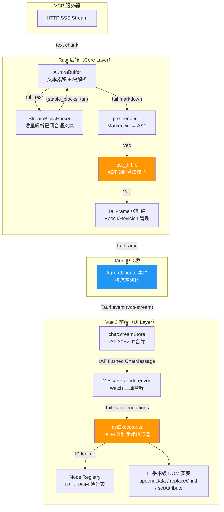
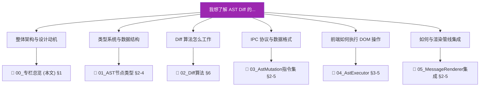
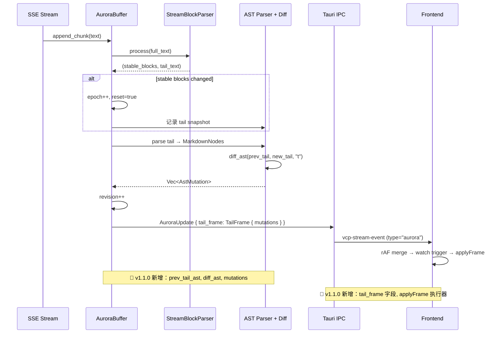

# 00_增量AST Diff渲染引擎专栏总览

> 本专栏深度覆盖 VCP Mobile v1.1.0 中最重磅的新增特性——**增量 AST Diff 渲染引擎（Incremental AST Diff Rendering Engine）**。该引擎横跨 Rust 后端、Tauri IPC 桥、Vue 3 前端三个层级，实现了流式 AI 对话场景下**手术刀级别的 DOM 增量更新**，彻底告别传统 innerHTML 全量重绘带来的性能瓶颈和视觉闪烁。

---

## 1. 概述

### 1.1 什么是增量 AST Diff 渲染

在流式 AI 对话中，AI 的回复是逐字、逐句到达的。传统做法是每次收到新文本就**全量重新解析 Markdown → 生成 HTML → 替换整个消息 DOM**（innerHTML），这在短消息中尚可接受，但对于包含代码块、表格、LaTeX 公式等复杂内容的流式输出，会导致：

- **性能问题**：每次 innerHTML 赋值都触发完整的浏览器解析、布局、绘制流程（~20-50ms），高频流式场景下产生严重卡顿
- **状态丢失**：`<video>` 播放进度、`` 加载状态、`<iframe>` 内容被销毁重建
- **视觉闪烁**：全量 DOM 替换导致文本区域短暂空白再重绘
- **输入框焦点丢失**：DOM 重建导致当前焦点元素被销毁

AST Diff 渲染引擎的核心思路是：**只变更真正变化的那几个 DOM 节点**。

### 1.2 核心优势

| 维度 | 传统 innerHTML | AST Diff 渲染 |
|------|---------------|--------------|
| 单次更新耗时 | ~20-50ms（全量 parse + layout） | ~0.5-3ms（手术级 DOM 操作） |
| 流式高频 IPC 载荷 | ~2-8KB（完整 HTML 字符串） | ~200-800 bytes（稀疏突变指令） |
| DOM 状态保持 | ❌ 全部丢失 | ✅ 保留（img/video/iframe 状态不受影响） |
| 渲染帧率 | 受 innerHTML 开销限制 | ~30Hz rAF 节流，稳定流畅 |
| 移动端功耗 | 高（频繁全量重绘） | 低（仅变更区域触发重绘） |
| 视觉稳定性 | 有闪烁 | 无闪烁（增量追加） |

### 1.3 整体架构

增量 AST Diff 渲染引擎采用**双层级架构（Two-Tier Architecture）**，由 Rust 后端负责计算"需要改什么"，前端负责"怎么改"：

数据流的三个关键阶段：

1. **Rust 侧 - 计算差异**：每次 `process_queue()` 调用，用 `prev_tail_ast` 与当前 tail 的新 AST 做 `diff_ast()`，产出 `Vec<AstMutation>`（增量变化指令）
2. **IPC 桥 - 稀疏传输**：`TailFrame` 封装 epoch/revision/mutations，通过 `AuroraUpdate` 稀疏序列化（只传变化的字段），经 Tauri event 发送
3. **前端侧 - 手术执行**：`astExecutor.applyFrame()` 遍历 mutations，通过 Node Registry（`Map<id, DOM Node>`）找到目标 DOM 节点，执行精确的 `appendData`/`replaceChild`/`setAttribute` 等操作

---

## 2. 文档地图

| 编号 | 文档 | 覆盖源码 | 核心主题 |
|:----:|------|----------|----------|
| 01 | [AST 节点类型与 Hash 指纹系统](01_AST节点类型与Hash指纹系统.md) | `pre_renderer/markdown_ast.rs` + `chat.ts` | MarkdownNode(8种)/InlineNode(11种) 类型系统、FxHasher 哈希指纹计算、前后端类型镜像 |
| 02 | [Aurora 管道 Epoch 体系与增量 Diff 算法](02_Aurora管道Epoch体系与增量Diff算法.md) | `aurora_pipeline.rs` (~237行) + `ast_diff.rs` (~516行) | AuroraBuffer 字段、Epoch/Revision 状态机、process_queue 全流程、diff_ast 递归算法 |
| 03 | [AstMutation 指令集与稀疏 IPC 协议](03_AstMutation指令集与稀疏IPC协议.md) | `ast_diff.rs` + `chat.ts` | 9 种突变指令详解（含 AddListItem）、TailFrame 帧信封、AuroraUpdate 稀疏序列化、IPC 生命周期 |
| 04 | [前端 AstExecutor DOM 外科引擎](04_前端AstExecutor_DOM外科引擎.md) | `astExecutor.ts` (~847行) + `astRenderer.ts` (~184行) | Node Registry 分片、createDomFromNode 映射、四级替换策略、HTML 修复、Snapshot 重建 |
| 05 | [MessageRenderer 集成与 rAF 渲染节流](05_MessageRenderer集成与rAF渲染节流.md) | `MessageRenderer.vue` + `chatStreamStore.ts` | rAF 30Hz 节流、mergeTailFrame 帧合并、watch 双路径、Epoch 追踪、错误恢复、调试体系 |

---

## 3. 快速决策树

### 按场景定位

| 我想解决的问题 | 应该阅读 |
|---------------|---------|
| 流式输出时前端为什么不会闪烁了？ | 00_§1.1 → 05_§3 |
| MarkdownNode 有哪些类型？hash 怎么算的？ | 01_§2-4 |
| AuroraBuffer 的 Epoch/Revision 是什么？ | 02_§3 |
| `diff_ast()` 算法具体怎么工作的？ | 02_§6 |
| AppendText 和 UpdateText 有什么区别？ | 02_§6.6 → 03_§2 |
| TailFrame 里的 reset/snapshot 影响什么？ | 03_§3 |
| AstMutation 的 9 种指令各自干什么？ | 03_§2 |
| 前端怎么从 mutation ID 找到 DOM 节点？ | 04_§2 |
| executeMutation 的四级替换策略是什么？ | 04_§5 |
| 为什么失败后不直接降级到 innerHTML？ | 04_§7 → 05_§5 |
| rAF 30Hz 节流怎么工作的？ | 05_§2 |
| 怎么开启 AST Debug 追踪？ | 05_§6 |

---

## 4. 术语速查表

| 英文术语 | 中文翻译 | 说明 |
|----------|----------|------|
| **AST (Abstract Syntax Tree)** | 抽象语法树 | Markdown 文本的结构化树形表示，每个节点对应一种 Markdown 元素 |
| **Tail / Tail Content** | 尾部内容 / 推测区 | 流式输出中尚未闭合的、正在增长的文本片段 |
| **Stable Block** | 稳定块 / 已闭合块 | 流式解析中已确认完成的语义块，不再变化 |
| **Epoch** | 纪元 | 标识 tail 内容的不同"世代"；稳定块到达、tail 清空或 AST 解析失败时递增 |
| **Revision** | 修订号 | 同一 Epoch 内的增量变化计数，每次 process_queue 产出新 mutations 时递增 |
| **AstMutation** | AST 突变指令 | 描述单个 DOM 操作的最小指令单元（如 "在节点 t0.i0 上追加文本 ' World'"） |
| **TailFrame** | 尾帧 | 封装一次 AST Diff 结果的传输信封，含 epoch/revision/reset/mutations |
| **Node Registry** | 节点注册表 | 前端维护的 `Map<nodeId, DOM Node>`，将突变 ID 映射到真实 DOM 节点 |
| **Sandbox** | 沙箱 | tail 渲染的 DOM 容器元素，所有 tail mutations 在此范围内执行 |
| **Snapshot** | 快照 | tail 的完整 AST，用于 epoch reset 时的全量重建或 mutation 失败的恢复 |
| **Sparse Serialization** | 稀疏序列化 | 仅序列化变化的字段（通过 `skip_serializing_if`），减少 IPC 载荷 |
| **rAF Throttling** | requestAnimationFrame 节流 | 使用浏览器 rAF 控制渲染帧率不超过 30Hz，降低移动端功耗 |
| **Speculative Rendering** | 推测渲染 | 在 tail 尚未闭合时就进行 AST 解析和预渲染，让用户看到"正在打字"的内容 |
| **Hash Fingerprint** | 哈希指纹 | AST 节点的内容哈希值，用于快速跳过未变化的节点，避免深度递归比较 |
| **FxHasher** | rustc 快速哈希器 | Rust 编译器使用的非加密哈希算法，速度优先于安全性，适合 AST 指纹场景 |
| **Morphdom** | 虚拟 DOM 差分库 | 轻量级 DOM diff 库，在 AST Diff 中作为复杂节点的局部更新策略和最终降级兜底 |

---

## 5. 与传统 Aurora 管道的关系

v1.0.x 的 Aurora 管道（`aurora_pipeline.rs`，详见 [10_Aurora语义沉淀管道](../10_Aurora语义沉淀管道.md)）已经实现了流式块解析和推测渲染，但 tail 区域仍然通过 innerHTML 全量更新。v1.1.0 的 AST Diff 引擎是在此基础上的**叠加增强**：

---

## 6. 与现有模块的关系

| 模块 | 关系类型 | 说明 |
|------|---------|------|
| `aurora_pipeline.rs` ([10_Aurora](../10_Aurora语义沉淀管道.md)) | **直接宿主** | AST Diff 在 `AuroraBuffer.process_queue()` 中作为 tail 处理的新步骤执行 |
| `ast_diff.rs` | **核心算法** | 提供 `diff_ast()` / `diff_markdown_nodes()` / `diff_inline_nodes()` 等 Diff 函数 |
| `pre_renderer/markdown_ast.rs` ([19_消息服务](../19_消息服务与预渲染管线.md)) | **数据类型** | `MarkdownNode` / `InlineNode` 是 Diff 算法的输入和 AstMutation 的载体 |
| `pre_renderer/markdown_parser.rs` | **AST 生产者** | `parse_markdown_to_ast_streaming()` 将 tail 文本解析为 `Vec<MarkdownNode>` |
| `stream_block_parser.rs` ([02_流式解析器](../02_流式响应解析器.md)) | **上游** | 识别稳定块 vs. tail 内容，决定何时触发 epoch 重置 |
| `vcp_client.rs` ([09_VCP客户端](../09_VCP请求客户端.md)) | **调用者** | 调用 `AuroraBuffer` 的 `append_chunk` / `process_queue` / `take_tail_frame` |
| `astExecutor.ts` | **前端执行器** | 消费 `AstMutation[]`，通过 Node Registry 执行手术级 DOM 操作 |
| `astRenderer.ts` | **降级路径** | 当 AST Diff 禁用时，回退到 AST → HTML 字符串的批量渲染路径 |
| `MessageRenderer.vue` | **集成层** | watch `tailFrame` 的变化，路由到 `applyFrame()` 或 snapshot 重建 |
| `chatStreamStore.ts` | **节流层** | rAF 30Hz 帧合并，防止高频 IPC 导致的渲染风暴 |

---

*文档基于 `src-tauri/src/vcp_modules/chat/ast_diff.rs`（~516行）、`src-tauri/src/vcp_modules/chat/aurora_pipeline.rs`（~237行）、`src/core/utils/astExecutor.ts`（~847行）、`src/core/utils/astRenderer.ts`（~184行）、`src/core/types/chat.ts`、`src/core/stores/chatStreamStore.ts`、`src/features/chat/MessageRenderer.vue` 的源码分析生成。*
