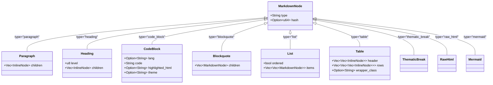
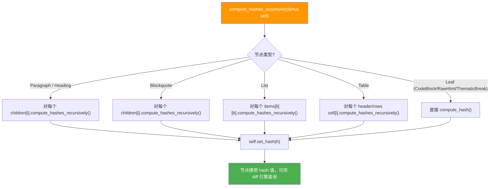
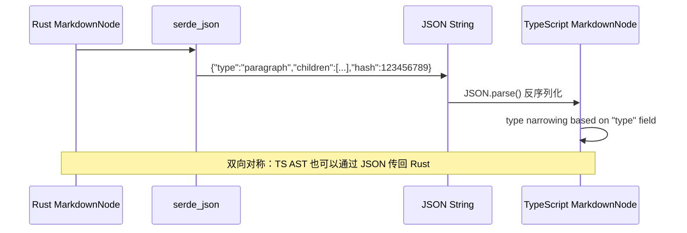

# 01_AST 节点类型与 Hash 指纹系统

## 1. 概述

### 1.1 模块定位

AST 节点类型系统是整个增量 Diff 渲染引擎的**数据基石（Data Foundation）**。它定义了流式 Markdown 文本的结构化表示——每一行文本、每一个加粗片段、每一个代码块，在 Diff 引擎眼中都是一个携带**唯一路径 ID** 和**内容哈希指纹**的 AST 节点。

核心源码位于 `src-tauri/src/vcp_modules/chat/pre_renderer/markdown_ast.rs`，定义了：
- **`MarkdownNode`** 枚举：**8 种**块级元素（Block-level Elements）
- **`InlineNode`** 枚举：**11 种**行内元素（Inline Elements）
- **哈希指纹系统**：基于 `rustc_hash::FxHasher` 的递归哈希计算
- **工厂方法**：便捷创建各类节点的构造器

前端在 `src/core/types/chat.ts` 中维护了**类型镜像**，确保 IPC 序列化/反序列化的类型安全。

### 1.2 在 AST Diff 管线中的角色

```mermaid
flowchart LR
    MD["Markdown 文本"] --> Parser["markdown_parser.rs<br/>pulldown-cmark 解析"]
    Parser --> AST["Vec&lt;MarkdownNode&gt;"]
    AST --> Hash["compute_hashes_recursively()"]
    Hash --> Diff["ast_diff.rs<br/>diff_ast(old_ast, new_ast)"]
    Diff --> Mutations["Vec&lt;AstMutation&gt;"]
    Mutations --> IPC["Tauri IPC"]
    IPC --> Executor["astExecutor.ts<br/>createDomFromNode"]

    style AST fill:#ff9800,color:#fff
    style Hash fill:#4caf50,color:#fff
```



### 1.3 双端类型镜像设计

Rust 和 TypeScript 分别维护 AST 类型定义，通过 `#[serde(tag = "type")]` 实现**内部标签序列化（Internally Tagged Serialization）**：

- **Rust 侧**：标准 `enum`，类型安全，带完整 `Hash` trait 实现
- **TypeScript 侧**：`type` 联合类型（Union Type），字段可选（`?`），兼容稀疏序列化
- **序列化线格式**：JSON 对象，`"type"` 字段决定变体，其余字段按 `camelCase` 序列化



---

## 2. MarkdownNode —— 块级元素（Block-level Elements）

定义于 `markdown_ast.rs:6-67`，共 **8 种**变体，通过 `#[serde(tag = "type")]` 实现内部标签序列化。

> **⚠️ 无独立 Mermaid 节点**：Mermaid 图表不是单独的 `MarkdownNode` 变体，而是 `lang === "mermaid"` 的 `code_block`。前端在 `astExecutor.ts` 的 `code_block` 分支里据此渲染为 `.mermaid-placeholder`（见 §2.4），后续由 `MessageRenderer.vue` 的异步管线渲染为 SVG。

### 2.1 变体总览表

| 序号 | `type` 标签 | Rust 变体 | 语义 | 有 Hash | Diff 策略 |
|:----:|------------|-----------|------|:-------:|----------|
| 1 | `paragraph` | `Paragraph { children, hash }` | 标准段落 | ✅ | 递归 diff inline children |
| 2 | `heading` | `Heading { level, children, hash }` | 标题 H1-H6 | ✅ | level 变则 UpdateProp，否则递归 diff inline children |
| 3 | `code_block` | `CodeBlock { lang, code, highlighted_html, theme, hash }` | 围栏代码块（含 `lang="mermaid"`） | ✅ | 整体 Replace（前端原地 innerHTML / mermaid textContent 优化） |
| 4 | `blockquote` | `Blockquote { children, hash }` | 嵌套引用块 | ✅ | 递归 diff 子 MarkdownNode |
| 5 | `list` | `List { ordered, items, hash }` | 有序/无序列表 | ✅ | ordered 变则 Replace；否则逐 item 递归 diff + **item 级别 AddListItem/Remove 增量**（见 03_§2.8） |
| 6 | `table` | `Table { header, rows, wrapper_class, hash }` | GFM 表格 | ✅ | 整体 Replace（前端 morphdom 优化） |
| 7 | `thematic_break` | `ThematicBreak` | 水平分割线 `<hr>` | ❌ | 整体 Replace |
| 8 | `raw_html` | `RawHtml { content, hash }` | 原始 HTML 块 | ✅ | 整体 Replace（前端 morphdom 优化） |

### 2.2 Paragraph（段落）

最常用的块级元素，承载绝大多数流式文本内容。

```rust
#[serde(rename = "paragraph")]
Paragraph {
    children: Vec<InlineNode>,       // 行内子节点列表
    hash: Option<u64>,               // 递归哈希指纹
}
```

**Diff 行为**：类型相同时，递归调用 `diff_inline_nodes(old_children, new_children, ...)`，对行内子节点做增量 diff。

**前端渲染**（`astExecutor.ts:179-186`）：
```typescript
case "paragraph":
  el = document.createElement("p");
  node.children?.forEach((child, i) => {
    const childId = `${id}.i${i}`;
    const childDom = createInlineDom(child, childId, registry);
    el.appendChild(childDom);
  });
```

### 2.3 Heading（标题）

```rust
#[serde(rename = "heading")]
Heading {
    level: u8,                       // 1-6，对应 h1-h6
    children: Vec<InlineNode>,       // 标题文本（行内元素）
    hash: Option<u64>,
}
```

**Diff 行为**：先检查 `level` 是否变化——若变化，发射 `UpdateProp { key: "level", value }`；然后递归 diff inline children。

**前端 Prop 应用**（`astExecutor.ts:550-554`）：
```typescript
if (mutation.key === "level" && /^H[1-6]$/i.test(node.tagName)) {
  const level = Math.max(1, Math.min(6, Number(mutation.value) || 1));
  const replacement = document.createElement(`h${level}`);
  // 复制 innerHTML 和 attributes，replaceChild
}
```

> 标题级别变更会触发**同标签名元素替换**（H2→H3），而非修改属性，因为 HTML 标题级别由标签名决定。

### 2.4 CodeBlock（代码块）

```rust
#[serde(rename = "code_block")]
CodeBlock {
    lang: Option<String>,                   // 编程语言标识
    code: String,                            // 原始代码文本
    highlighted_html: Option<String>,        // syntect 预渲染的 HTML
    theme: Option<String>,                   // 高亮主题
    hash: Option<u64>,
}
```

**Diff 行为**：整体 Replace。前端实现**原地 innerHTML 覆盖**优化（策略 A），不销毁 `<pre>` 外壳元素。

### 2.5 Blockquote（引用块）

```rust
#[serde(rename = "blockquote")]
Blockquote {
    children: Vec<MarkdownNode>,  // 引用内的块级内容（递归）
    hash: Option<u64>,
}
```

**Diff 行为**：递归调用 `diff_markdown_nodes(old_children, new_children, ...)`，前缀为 `{node_id}.b`。

### 2.6 List（列表）

```rust
#[serde(rename = "list")]
List {
    ordered: bool,                           // true=有序列表(ol), false=无序列表(ul)
    items: Vec<Vec<MarkdownNode>>,           // 二维数组：每个 item 可含多个块级节点
    hash: Option<u64>,
}
```

**Diff 行为**：
- 如果 `ordered` 字段变化 → 整体 Replace
- 否则逐 item 递归 diff（前缀 `{node_id}.liN`），如果 item 数量变化 → 整体 Replace

### 2.7 Table（表格）

```rust
#[serde(rename = "table")]
Table {
    header: Vec<Vec<InlineNode>>,            // 表头行，每个单元格含多个行内节点
    rows: Vec<Vec<Vec<InlineNode>>>,         // 数据行，三维数组
    wrapper_class: Option<String>,           // CSS 类名，默认 "vcp-scrollable no-swipe"
    hash: Option<u64>,
}
```

**Diff 行为**：整体 Replace。前端实现**morphdom 局部 DOM diff**（策略 C），保留表格滚动位置和视频/图片状态。

### 2.8 ThematicBreak（水平分割线）

```rust
#[serde(rename = "thematic_break")]
ThematicBreak,
```

无字段枚举变体。Diff 行为：整体 Replace。前端渲染为 `<hr>`。

### 2.9 RawHtml（原始 HTML 块）

```rust
#[serde(rename = "raw_html")]
RawHtml {
    content: String,           // 原始 HTML 字符串
    hash: Option<u64>,
}
```

用于 HTML 容器包装（`<div>`/`<section>` 等）。Diff 行为：整体 Replace。前端通过 `repairHtmlFragment()` 修复流式断口后赋值 `innerHTML`，再用 morphdom 做局部 diff。

### 2.10 Mermaid（通过 `code_block` 表达，无独立节点）

Mermaid 图表**没有**独立的 `MarkdownNode` 变体。它就是一个 `lang === "mermaid"` 的 `code_block`：

- 后端 `markdown_parser.rs` 的 `finalize()` 对 `lang == "mermaid"` 跳过 syntect 高亮（`highlighted_html = None`）。
- 前端 `astExecutor.ts` 的 `code_block` 分支检测到 `node.lang === "mermaid"` 时，创建 `<div class="mermaid-placeholder">` 并把源码写入 `textContent`，而非渲染为 `<pre>`。
- Replace 时走**策略 B（原地 textContent 覆盖）**：保留 placeholder 元素，后续由 `MessageRenderer.vue` 的 `renderHeavyContent()` 经 `mermaid.run()` 异步渲染为 SVG。

---

## 3. InlineNode —— 行内元素（Inline Elements）

定义于 `markdown_ast.rs:72-150`，共 **11 种**变体。

> **⚠️ 与旧设计的关键差异**：VCP 魔法标记（引号 `"..."`、`#标签`、`!告警`）已**统一收敛为单个 `vcp_custom { kind, value, children }`** 变体（`kind` 取 `"quote"`/`"highlight"`/`"alert"`），不再是三个独立节点。硬/软换行也**合并为单个 `break`**（无 `line_break`/`soft_break` 之分）。前端 `chat.ts` 镜像类型与此一致。

### 3.1 变体总览表

| 序号 | `type` 标签 | Rust 变体 | 语义 | 有 Hash | Diff 策略 |
|:----:|------------|-----------|------|:-------:|----------|
| 1 | `text` | `Text { value }` | 纯文本 | ❌ | AppendText / UpdateText 优化 |
| 2 | `strong` | `Strong { children, hash }` | **粗体** | ✅ | 递归 diff inline children |
| 3 | `emphasis` | `Emphasis { children, hash }` | *斜体* | ✅ | 递归 diff inline children |
| 4 | `code` | `Code { value }` | 行内代码 | ❌ | 值变才 ReplaceInline（值同则零 mutation） |
| 5 | `link` | `Link { href, title, children, needs_asset_conversion, hash }` | 超链接 | ✅ | href/title 变则 ReplaceInline；否则递归 diff children |
| 6 | `image` | `Image { src, alt, title, needs_asset_conversion, hash }` | 图片 | ✅ | 原地属性更新（策略 B） |
| 7 | `break` | `Break` | 软/硬换行 `<br>` | ❌ | 同类型 no-op（零 mutation） |
| 8 | `inline_math` | `InlineMath { content, display_mode, hash }` | LaTeX 公式 | ✅ | 原地 data-latex + textContent 更新 |
| 9 | `vcp_custom` | `VcpCustom { kind, value, children, hash }` | VCP 魔法标记（引号/`#标签`/`!告警`，由 `kind` 区分） | ✅ | kind/value 变则 ReplaceInline；有 children 则递归 diff，否则原地 textContent |
| 10 | `strikethrough` | `Strikethrough { children, hash }` | ~~删除线~~ | ✅ | 递归 diff children |
| 11 | `raw_html_inline` | `RawHtmlInline { content, hash }` | 行内原始 HTML | ✅ | morphdom 局部 diff |

> **判别式字节**：`InlineNode` 的 `Hash` 实现中，各变体的 discriminant byte 并非连续（见 `markdown_ast.rs` 的 `impl Hash`）：`text=0, strong=1, emphasis=2, code=3, link=4, image=5, break=6, inline_math=8, strikethrough=10, raw_html_inline=13, vcp_custom=14`。中间空缺是历史变体移除/合并留下的，因仅用于同进程内防碰撞、无需连续，故未重排。

### 3.2 关键 InlineNode 详解

#### Text（纯文本）—— 最关键的 Diff 优化对象

```rust
#[serde(rename = "text")]
Text { value: String }
```

**无 Hash**。这是整个流式 Diff 中**最关键**的节点类型——因为流式输出中 90% 以上的变更是"在已有文本末尾追加字符"。

**Text Diff 优化**（`ast_diff.rs` 的 `diff_text_node`）：

```rust
fn diff_text_node(id: &str, old_value: &str, new_value: &str, mutations: &mut Vec<AstMutation>) {
    if new_value == old_value {
        return;  // 完全相同，无操作
    }
    if let Some(chunk) = new_value.strip_prefix(old_value) {
        if !chunk.is_empty() {
            // 🟢 热路径：新值以旧值为前缀 → 只需 AppendText
            mutations.push(AstMutation::AppendText { id: id.to_string(), chunk: chunk.to_string() });
        }
    } else {
        // 🟡 冷路径：文本发生非单调变化 → 全量 UpdateText
        mutations.push(AstMutation::UpdateText { id: id.to_string(), value: new_value.to_string() });
    }
}
```

这个优化保证了流式逐字输出时，90%+ 的 Text 节点变更是廉价的 `AppendText`（前端只需 `textNode.appendData(chunk)`），而非昂贵的 `UpdateText`（`textNode.textContent = value`）。

#### Link（超链接）

```rust
Link {
    href: String,
    title: Option<String>,
    children: Vec<InlineNode>,
    needs_asset_conversion: bool,  // vcp-asset: 或 / 开头路径需转换为 asset:// 协议
    hash: Option<u64>,
}
```

Diff 决策树：
```
href 或 title 变化 ?
  ├─ Yes → ReplaceInline (整体替换)
  └─ No  → 递归 diff children
```

#### Image（图片）

```rust
Image {
    src: String,
    alt: String,
    title: Option<String>,
    needs_asset_conversion: bool,
    hash: Option<u64>,
}
```

Diff 行为：`ReplaceInline`。前端实现**原地属性更新**（策略 B），不销毁 `` 元素，保留图片加载状态。

#### VcpCustom（VCP 魔法标记）

```rust
VcpCustom {
    kind: String,                        // "quote" | "highlight" | "alert"
    value: Option<String>,               // 叶子型标记（highlight/alert）的文本值
    children: Option<Vec<InlineNode>>,   // 容器型标记（quote）的子节点
    hash: Option<u64>,
}
```

由 `markdown_parser.rs` 的 `process_text_magic()` 产出：魔法引号 `"..."` → `kind="quote"`（带 children），`@!告警` → `kind="alert"`（带 value），`@标签` → `kind="highlight"`（带 value）。前端渲染为 `<span class="vcp-custom-{kind}">`。

Diff 决策树：
```
kind 或 value 变化 ?
  ├─ Yes → ReplaceInline (整体替换)
  └─ No  → 有 children 则递归 diff children；否则（叶子型）原地 textContent 更新
```

---

## 4. 哈希指纹系统

### 4.1 设计目标

哈希指纹系统是 AST Diff **性能优化的核心**。它的目标是：

> 当两个 AST 节点在前后两帧中**内容完全相同**时，能够在 O(1) 时间内跳过递归比较，直接判定为"无需变更"。

### 4.2 为什么用 FxHasher

```rust
// markdown_ast.rs:241-244
pub fn compute_hash(&self) -> u64 {
    let mut hasher = rustc_hash::FxHasher::default();
    std::hash::Hash::hash(self, &mut hasher);
    std::hash::Hasher::finish(&hasher)
}
```

`rustc_hash::FxHasher` 是 Rust 编译器内部使用的非加密哈希算法：

| 指标 | FxHasher | SipHash (std) | SHA-256 |
|------|----------|---------------|---------|
| 速度 | ⚡ 极快 (~1 cycle/byte) | 🐢 慢 (~10 cycles/byte) | 🐢 极慢 |
| 碰撞率 | 适中（64位） | 低 | 极低 |
| 确定性 | ✅ 是 | ✅ 是 | ✅ 是 |
| 安全性 | ❌ 非加密 | ✅ DoS 防护 | ✅ 加密级 |

> 选择 FxHasher 的关键原因：AST 节点哈希仅用于**同进程内快速比较**，不需要 DoS 防护或跨进程一致性。64 位哈希在节点数 <1000 的 tail AST 场景中碰撞概率可忽略不计。

### 4.3 哈希的计算范围

`std::hash::Hash` trait 的实现在 `markdown_ast.rs` 末尾的 `impl Hash`，定义了每个节点类型参与哈希计算的字段：

**MarkdownNode 哈希包围盒**（共 8 变体）：

| 变体 | Discriminant Byte | 哈希字段 |
|------|:---:|------|
| Paragraph | `0` | `children` 中每个 InlineNode 的 hash 值（或递归哈希） |
| Heading | `1` | `level` + `children` 的 hash |
| CodeBlock | `2` | `lang` + `code` + `highlighted_html` + `theme`（mermaid 即 `lang="mermaid"` 的 CodeBlock） |
| Blockquote | `3` | `children` 中每个 MarkdownNode 的 hash |
| List | `4` | `ordered` + `items` 中所有节点的 hash |
| Table | `5` | `wrapper_class` + `header`/`rows` 中所有 InlineNode 的 hash |
| ThematicBreak | `6` | 仅 discriminant byte（无字段） |
| RawHtml | `7` | `content` 字符串 |

> **Design Note**：每个变体的 hash 实现中都使用了 `discriminant byte`（0-7）作为前缀，防止不同变体产生相同哈希值（如 Paragraph 和 Heading 有相同的 children 内容）。

### 4.4 哪些节点不计算哈希

| 节点类型 | 原因 |
|---------|------|
| `Text` | 是最频繁变化的叶子节点，通过 `AppendText` 优化处理，哈希无意义 |
| `Code`（行内） | 同 Text，文本值直接比较更高效（值同则零 mutation） |
| `Break` | 无字段枚举，O(1) 判别（同类型 no-op） |
| `ThematicBreak` | 无字段枚举 |

> 注：`vcp_custom`（含旧 `highlight`/`alert`/`quote`）**有 hash**——它统一为带 `kind`/`value`/`children` 的变体，需要 hash 来跳过未变化的容器型标记。

### 4.5 递归哈希计算流程



### 4.6 哈希在 Diff 中的使用

在 `diff_markdown_nodes` 和 `diff_inline_nodes` 中，**哈希是第一个检查条件**：

```rust
// ast_diff.rs:63-65
if old_node.get_hash() == new_node.get_hash() && old_node.get_hash().is_some() {
    continue; // Hash 命中，相同，直接跳过 —— 零开销！
}
```

这个检查在**稳态流式输出**中效果显著：当 tail 中前面的大部分段落已经稳定（不再变化），只有最后一个段落和行内节点在增长，前面所有段落的哈希都匹配，`diff_markdown_nodes` 对它们只做 O(1) 的哈希比较（而非 O(n) 递归遍历）。

**典型稳态场景**：
```
Epoch 5, Revision 3:
  t0: Paragraph "这是第一段..."     → hash 匹配，跳过 ✅ (O(1))
  t1: Paragraph "这是第二段..."     → hash 匹配，跳过 ✅ (O(1))
  t2: Paragraph "这是第三段文本"     → hash 不匹配，递归 diff children
    t2.i0: Text "这是"              → hash 无（Text叶子）
    t2.i1: Text "第三段文本..."      → strip_prefix → AppendText "..." ✅
```

---

## 5. 前端镜像类型

### 5.1 TypeScript 类型定义

定义于 `src/core/types/chat.ts`（与 Rust 8/11 变体完全对齐）：

```typescript
export type MarkdownNode = {
  type: "paragraph" | "heading" | "code_block" | "blockquote" |
        "list" | "table" | "thematic_break" | "raw_html";
  children?: InlineNode[];
  level?: number;
  lang?: string;
  code?: string;
  highlighted_html?: string;
  theme?: string;
  ordered?: boolean;
  items?: MarkdownNode[][];
  header?: InlineNode[][];
  rows?: InlineNode[][][];
  wrapper_class?: string;
  content?: string;
  encoded?: string;
  hash?: string | number;  // Rust Option<u64> → TS string | number
};

export type InlineNode = {
  type: "text" | "strong" | "emphasis" | "strikethrough" | "code" |
        "link" | "image" | "break" | "inline_math" |
        "vcp_custom" | "raw_html_inline";
  kind?: string;          // vcp_custom 专用："quote" | "highlight" | "alert"
  value?: string;
  children?: InlineNode[];
  href?: string;
  src?: string;
  alt?: string;
  title?: string;
  needs_asset_conversion?: boolean;
  content?: string;
  display_mode?: boolean;
  hash?: string | number;
};
```

> TS 镜像始终与 Rust 端保持同步（无 `mermaid`、无 `line_break`/`soft_break`、无 `quoted_text`/`highlight_tag`/`alert_tag`；统一为 `break` 与 `vcp_custom`）。

### 5.2 Rust vs TypeScript 类型差异

| 维度 | Rust | TypeScript | 原因 |
|------|------|-----------|------|
| 类型安全 | 编译时穷举检查 | 运行时 duck typing | TS 通过 `type` 字段区分变体 |
| 字段可选性 | 每个变体字段确定 | 所有字段 `?` 可选 | TS union type 须兼容所有变体 |
| hash 类型 | `Option<u64>` | `string \| number` | JSON 序列化后数字可能变字符串 |
| ThematicBreak | 无字段变体 | 同样（type 标签在外层） | JSON 中只有 `{"type":"thematic_break"}` |

### 5.3 序列化/反序列化流程



---

## 6. 与相关模块的关系

| 模块 | 关系 | 说明 |
|------|------|------|
| `markdown_parser.rs` | **生产者** | `parse_markdown_to_ast()` 产出 `Vec<MarkdownNode>` |
| `ast_diff.rs` | **消费者** | `diff_ast()` 接受 `&[MarkdownNode]` 作为输入 |
| `aurora_pipeline.rs` | **调用者** | `process_queue()` 中调用 `parse_markdown_to_ast_streaming()` 和 `compute_hashes_recursively()` |
| `astExecutor.ts` | **DOM 生产者** | `createDomFromNode()` 将 MarkdownNode 转为真实 DOM 元素 |
| `astRenderer.ts` | **HTML 降级路径** | `renderMarkdownNodes()` 在禁用 AST Diff 时使用 |
| `sync_hash.rs` | **内容指纹** | `HashAggregator` 提供完整内容级别的哈希，与 AST 节点级哈希互补 |

---

*文档基于 `src-tauri/src/vcp_modules/chat/pre_renderer/markdown_ast.rs`（~675行）及 `src/core/types/chat.ts` 的源码分析生成。*
