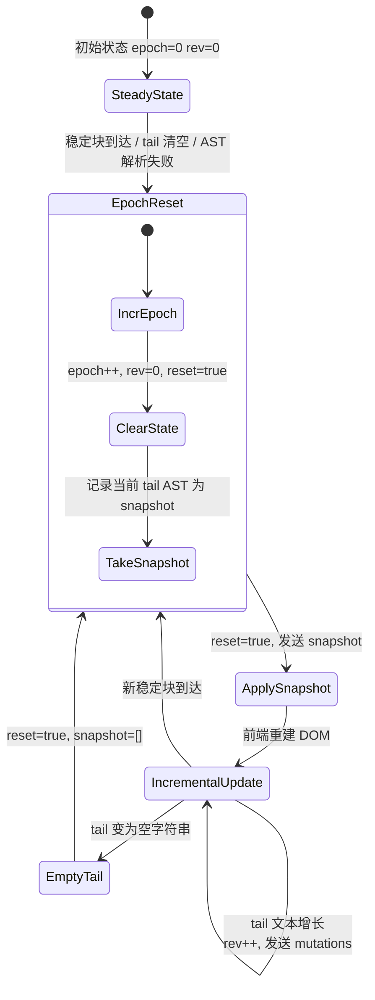
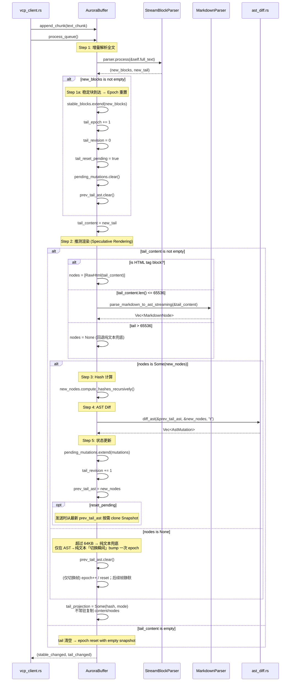
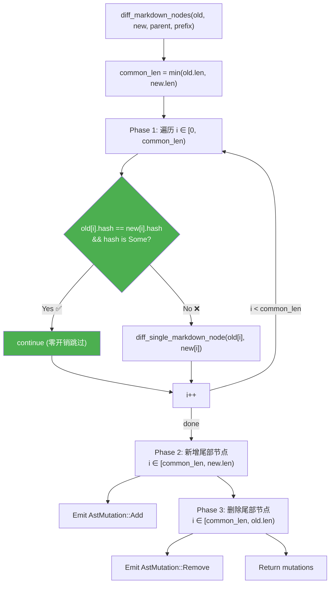
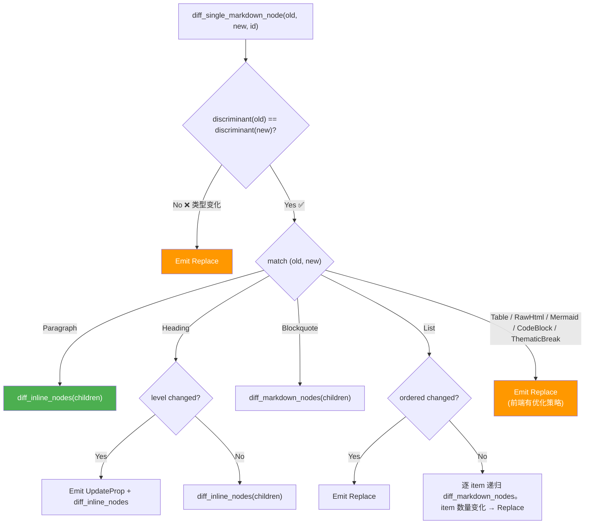

# 02_Aurora 管道 Epoch 体系与增量 Diff 算法

## 1. 概述

### 1.1 模块定位

本章覆盖 AST Diff 引擎的**Rust 后端核心**：`aurora_pipeline.rs`（~237行）和 `ast_diff.rs`（~516行含测试）。前者是**状态管理者和流程编排者**，后者是**差异计算引擎**。

```
┌─────────────────────────────────────┐
│  aurora_pipeline.rs                 │
│  AuroraBuffer                       │
│  ├─ 文本累积 (append_chunk)         │
│  ├─ 流式块解析 (process_queue)      │
│  ├─ Tail AST 解析 + Hash 计算       │
│  ├─ 调用 ast_diff.rs 做增量 Diff    │
│  ├─ Epoch/Revision 状态管理         │
│  └─ 帧封装与取出 (take_tail_frame)  │
└──────────┬──────────────────────────┘
           │ 调用
           ▼
┌─────────────────────────────────────┐
│  ast_diff.rs                        │
│  ├─ diff_ast() — 对外入口           │
│  ├─ diff_markdown_nodes()           │
│  ├─ diff_single_markdown_node()     │
│  ├─ diff_inline_nodes()             │
│  ├─ diff_single_inline_node()       │
│  └─ diff_text_node() — Append优化   │
└─────────────────────────────────────┘
```

### 1.2 v1.0.3 → v1.1.0 关键变更

| 维度 | v1.0.3 | v1.1.0 |
|------|--------|--------|
| AuroraBuffer 字段数 | 5 | 12（新增 7 个） |
| Tail 更新方式 | innerHTML 全量替换 | AstMutation 增量指令 + DOM 手术 |
| IPC 载荷 | 完整 tail HTML (2-8KB) | 稀疏 TailFrame (200-800 bytes) |
| Epoch 语义 | 仅标识 tail 变化 | Epoch + Revision 双级时序 |
| 前端执行 | `v-html` 绑定 | `applyFrame()` + Node Registry |

---

## 2. AuroraBuffer —— 流式缓冲区的 v1.1.0 全貌

### 2.1 完整字段表

定义于 `aurora_pipeline.rs:58-74`：

| 字段 | 类型 | v1.0.3 | v1.1.0 | 说明 |
|------|------|:-----:|:-----:|------|
| `full_text` | `String` | ✅ | ✅ | SSE 累积全文 |
| `stable_blocks` | `Vec<StreamBlock>` | ✅ | ✅ | 已确认闭合的语义块列表 |
| `tail_content` | `String` | ✅ | ✅ | 当前尾部推测文本 |
| `tail_projection` | `Option<TailProjection>` | — | ✅ | 保存增量 SHA-256 fingerprint/mode；完整 wire block 在 Snapshot 时构造 |
| `parser` | `StreamBlockParser` | ✅ | ✅ | 有状态流式块解析器 |
| `is_finishing` | `bool` | ✅ | ✅ | 是否已进入结束状态 |
| **🆕 `prev_tail_ast`** | `Vec<MarkdownNode>` | — | ✅ | 当前唯一 canonical tail AST；也是下一帧 Diff 的旧基准 |
| **🆕 `pending_mutations`** | `Vec<AstMutation>` | — | ✅ | 待发送的突变指令暂存池 |
| **🆕 `tail_epoch`** | `u64` | — | ✅ | 纪元计数器 |
| **🆕 `tail_revision`** | `u64` | — | ✅ | 纪元内修订计数器 |
| **🆕 `tail_reset_pending`** | `bool` | — | ✅ | 是否需前端全量重建 |
| **🆕 `tail_frame_seq`** | `u64` | — | ✅ | 单调帧序号 |

### 2.2 Epoch / Revision 双级时序体系

这是 v1.1.0 新增的**最核心概念**，用于管理 tail 内容的"世代更迭"和"增量演进"：



**Epoch（纪元）**：标识 tail 内容的不同"世代"。当以下情况发生时递增：
- 新的稳定块被识别（tail 内容从旧文本变为全新内容）
- tail 变为空字符串
- AST 解析失败（退回到原始 HTML 模式）

**Revision（修订号）**：同一 Epoch 内的增量变化计数。每次 `process_queue()` 产出新的 mutations 时递增。

> **为什么需要 Epoch？** 没有 Epoch 时，前端无法区分"tail 内容是上一帧的增量"还是"tail 内容被完全替换为新话题"。如果前端错误地将全量替换当成增量追加，会导致 UI 显示混乱。Epoch 机制确保了"不同世代的内容不混合"。

### 2.3 相关常量和阈值

```rust
// aurora_pipeline.rs:8
const MAX_SPECULATIVE_TAIL_AST_BYTES: usize = 65536;
```

当 tail 文本超过 64KB 时（包括 RawHtml），跳过 AST 解析，回退到**纯文本兜底模式**。常态 Delta 通过 `tailOp` 追加文本；Snapshot 才按需构造不含 nodes 的 `tail_block`，前端使用字面文本路径，**绝不留白**。

---

## 3. process_queue() —— 核心处理循环

### 3.1 完整流程

定义于 `aurora_pipeline.rs:123-217`。每次 SSE chunk 到达后调用，处理步骤：



### 3.2 步骤详解

#### Step 1：增量解析全文

```rust
let (new_blocks, new_tail) = self.parser.process(&self.full_text);
```

`StreamBlockParser` 维护内部 `processed_len` 游标，只处理新增文本。返回已闭合的语义块列表和剩余 tail 文本。

**Epoch 重置逻辑**（第 134-141 行）：
```rust
if !new_blocks.is_empty() {
    self.stable_blocks.extend(new_blocks);
    self.tail_epoch = self.tail_epoch.saturating_add(1);  // 纪元 +1
    self.tail_revision = 0;          // 修订号归零
    self.tail_reset_pending = true;  // 通知前端全量重建
    self.pending_mutations.clear();  // 清空旧突变
    self.prev_tail_ast.clear();      // 清空旧 AST 基准
}
```

这一步保证了**当 tail 内容发生结构性变更（新的语义块闭合），前端完全丢弃旧 DOM 状态，用新 snapshot 重建**。

#### Step 2：推测渲染

```rust
if !self.tail_content.is_empty() {
    let nodes = if self.tail_content.len() > MAX_SPECULATIVE_TAIL_AST_BYTES {
        None  // 包括 RawHtml 在内，统一回退纯文本兜底
    } else if is_html_tag_block(&self.tail_content) {
        // HTML 标签块：直接包装为 RawHtml，不经过 markdown parser
        Some(vec![MarkdownNode::raw_html(self.tail_content.clone())])
    } else {
        // 正常路径：解析为 AST
        Some(parse_markdown_to_ast_streaming(&self.tail_content))
    };
    // ...
}
```

三个分支的语义：
| 条件 | 策略 | 理由 |
|------|------|------|
| > 64KB（包括 HTML） | `nodes=None` → **纯文本兜底** | 防止性能悬崖；常态走 `tailOp` 字面文本追加 |
| ≤ 64KB 且以 HTML 标签开头 | 包装为 `RawHtml` | 防止 pulldown-cmark 将 CSS/内联样式解析为代码块 |
| ≤ 64KB 且非 HTML | 正常 AST 解析 | 标准推测渲染路径 |

> **降级只 bump 一次 epoch**：当 tail 跨过 64KB 进入纯文本兜底时，**仅在 AST 模式 → 纯文本模式的「切换帧」**递增一次 epoch/reset；此后保持安静，不再每帧 bump。这与旧版「每帧 `nodes=None` 并 bump epoch/reset（降级到 innerHTML、反复留白）」的行为根本不同——旧版会在超阈值后每帧清空重建，造成可见闪烁。

#### Step 3-4：Hash 计算 + AST Diff

```rust
if let Some(mut new_nodes) = nodes {
    for node in &mut new_nodes {
        node.compute_hashes_recursively();  // Step 3
    }
    let mutations = diff_ast(&self.prev_tail_ast, &new_nodes, "t");  // Step 4
    if !mutations.is_empty() {
        self.pending_mutations.extend(mutations);
    }
    self.tail_revision = self.tail_revision.saturating_add(1);
    self.prev_tail_ast = new_nodes;  // 更新 Diff 基准
}
```

### 3.3 take_tail_frame() —— 帧封装与取出

定义于 `aurora_pipeline.rs:100-119`：

```rust
pub fn take_tail_frame(&mut self) -> Option<TailFrame> {
    let frame = self.peek_tail_frame(false)?;
    self.tail_reset_pending = false;
    self.pending_mutations.clear();
    self.tail_frame_seq = frame.frame_seq;
    Some(frame)
}
```

> **关键设计**：生产发送使用 prepare → send → commit；上面省略了成功后的 commit。`reset=true` 时直接从唯一的 `prev_tail_ast` 构造完整 Snapshot，不再常驻第二棵 `tail_snapshot_pending`。

### 3.4 finalize() —— 流结束时的收尾

定义于 `aurora_pipeline.rs:220-236`：

```rust
pub fn finalize(&mut self) {
    if self.is_finishing { return; }
    self.is_finishing = true;
    let final_new_blocks = self.parser.finalize(&self.full_text);
    self.stable_blocks.extend(final_new_blocks);
    self.tail_content.clear();
    self.tail_projection = None;
    self.prev_tail_ast.clear();
    self.pending_mutations.clear();
    self.tail_epoch = self.tail_epoch.saturating_add(1);
    self.tail_revision = 0;
    self.tail_reset_pending = true;
}
```

最终帧发送一个 `reset=true, snapshot=[]` 的 TailFrame，前端收到后将 tail sandbox 清空，后续由稳定块（stable_blocks）接管渲染。

---

## 4. AST Diff 算法核心

### 4.1 算法概述

`ast_diff.rs` 中的 Diff 算法采用**三阶段线性扫描 + 类型分发递归**策略，时间复杂度 O(min(m, n) + |m-n|)，其中 m 和 n 是旧/新 AST 的块级节点数。

算法的核心思路是**数组级别的位置对应比较（Positional Correspondence）**，而非树级别的结构编辑距离——这基于一个关键假设：

> 在流式输出场景中，tail 的 AST 结构是**单调增长**的：新节点只追加到末尾，已有节点的**类型不变**（或极少变），变化主要集中在**文本内容的增长**。

```
旧 AST: [P1, P2, P3_partial]
新 AST: [P1, P2, P3_full]

Diff 结果:
  P1: hash 匹配 → 跳过
  P2: hash 匹配 → 跳过
  P3: hash 不匹配 → diff_children
    children[0]: Text "旧文本" vs "旧文本..." → AppendText "..."
    children[1]: (新增) Bold "..." → AddInline
```

### 4.2 节点 ID 命名体系

Diff 引擎使用从头到尾的**路径式 ID（Path-based ID）**，根前缀为 `"t"`：

| ID 模式 | 含义 | 示例 |
|---------|------|------|
| `t{N}` | 第 N 个块级节点 | `t0`, `t1`, `t2` |
| `t{N}.i{M}` | 第 N 个块级节点的第 M 个行内子节点 | `t0.i0`, `t0.i1` |
| `t{N}.i{M}.i{K}` | 第 M 个行内节点的第 K 个子行内节点 | `t0.i0.i0` |
| `t{N}.b{M}` | 第 N 个块级节点（Blockquote）的第 M 个子块 | `t2.b0` |
| `t{N}.li{M}` | 第 N 个块级节点（List）的第 M 个列表项 | `t1.li0` |
| `t{N}.li{M}.b{K}` | 列表项的第 K 个子块 | `t1.li0.b0` |

> 这个 ID 体系被前端 Node Registry 完整复用——`registry.get("t0.i0")` 直接返回对应的 DOM 文本节点。

### 4.3 diff_ast() —— 入口函数

```rust
// ast_diff.rs:38-46
pub fn diff_ast(
    old_nodes: &[MarkdownNode],
    new_nodes: &[MarkdownNode],
    prefix: &str,  // 通常为 "t"
) -> Vec<AstMutation> {
    let mut mutations = Vec::new();
    diff_markdown_nodes(old_nodes, new_nodes, "root", prefix, &mut mutations);
    mutations
}
```

纯函数，无副作用。`parent_id = "root"` 表示顶级节点直接挂载在 sandbox 下。

### 4.4 diff_markdown_nodes() —— 块级节点数组 Diff

```rust
// ast_diff.rs:48-85
pub fn diff_markdown_nodes(
    old_list: &[MarkdownNode],
    new_list: &[MarkdownNode],
    parent_id: &str,
    prefix: &str,
    mutations: &mut Vec<AstMutation>,
) {
    let common_len = old_list.len().min(new_list.len());

    // Phase 1: 公共部分逐个对比
    for i in 0..common_len {
        let node_id = format!("{}{}", prefix, i);
        if old_list[i].get_hash() == new_list[i].get_hash() && old_list[i].get_hash().is_some() {
            continue;  // 哈希命中 → 跳过
        }
        diff_single_markdown_node(&old_list[i], &new_list[i], &node_id, mutations);
    }

    // Phase 2: 新增的尾部节点
    for (i, item) in new_list.iter().enumerate().skip(common_len) {
        mutations.push(AstMutation::Add { id: format!("{}{}", prefix, i), parent: parent_id.to_string(), node: item.clone() });
    }

    // Phase 3: 删除的尾部节点
    for i in common_len..old_list.len() {
        mutations.push(AstMutation::Remove { id: format!("{}{}", prefix, i) });
    }
}
```



### 4.5 diff_single_markdown_node() —— 单节点类型分发

```rust
// ast_diff.rs:87-212
fn diff_single_markdown_node(old_node, new_node, node_id, mutations) {
    // Guard 1: 判别式变化 → 整体 Replace
    if std::mem::discriminant(old_node) != std::mem::discriminant(new_node) {
        mutations.push(AstMutation::Replace { id: node_id, node: new_node.clone() });
        return;
    }

    // Guard 2: 按类型分发递归
    match (old_node, new_node) {
        (Paragraph { children: old_c }, Paragraph { children: new_c }) =>
            diff_inline_nodes(old_c, new_c, node_id, "{node_id}.i", mutations),

        (Heading { level: old_l, children: old_c },
         Heading { level: new_l, children: new_c }) => {
            if old_l != new_l {
                mutations.push(AstMutation::UpdateProp { id: node_id, key: "level", value: new_l.to_string() });
            }
            diff_inline_nodes(old_c, new_c, node_id, "{node_id}.i", mutations)
        },

        (Blockquote { children: old_c }, Blockquote { children: new_c }) =>
            diff_markdown_nodes(old_c, new_c, node_id, "{node_id}.b", mutations),

        (List { ordered: old_o, items: old_i }, List { ordered: new_o, items: new_i }) => {
            if old_o != new_o {
                mutations.push(AstMutation::Replace { ... });
            } else {
                // 逐项递归
                for i in 0..old_i.len().min(new_i.len()) {
                    diff_markdown_nodes(&old_i[i], &new_i[i], "{node_id}.li{i}", ...);
                }
                if old_i.len() != new_i.len() {
                    mutations.push(AstMutation::Replace { ... });
                }
            }
        },

        // 叶子节点：直接 Replace
        _ => mutations.push(AstMutation::Replace { id: node_id, node: new_node.clone() }),
    }
}
```



### 4.6 diff_text_node() —— AppendText 优化

```rust
// ast_diff.rs:381-399
fn diff_text_node(id: &str, old_value: &str, new_value: &str, mutations: &mut Vec<AstMutation>) {
    match new_value.strip_prefix(old_value) {
        Some("") => {}
        Some(chunk) => mutations.push(AstMutation::AppendText {
            id: id.to_string(), chunk: chunk.to_string(),
        }),
        None => mutations.push(AstMutation::UpdateText {
            id: id.to_string(), value: new_value.to_string(),
        }),
    }
}
```

这是流式场景中最关键的优化。在 AI 逐字输出过程中：

| 场景 | 旧值 | 新值 | 操作 | 前端执行 |
|------|------|------|------|---------|
| 追加文本 | `"Hello"` | `"Hello World"` | **AppendText** `chunk=" World"` | `textNode.appendData(" World")` (~1μs) |
| 修改文本 | `"Hello"` | `"Hi"` | **UpdateText** `value="Hi"` | `textNode.textContent = "Hi"` (~0.1ms) |
| 相同文本 | `"Hello"` | `"Hello"` | **无操作** | — |

> 在流式输出中，**约 90% 的 Text 节点变更命中 AppendText 热路径**，这是 AST Diff 性能远超 innerHTML 的关键优化。

### 4.7 diff_inline_nodes() 和 diff_single_inline_node()

行内节点的 Diff 结构与块级节点对称，同样使用三阶段（公共对比、新增、删除）+ 类型分发递归：

- **Text** → `diff_text_node()`
- **Strong / Emphasis / QuotedText / Strikethrough** → 递归 `diff_inline_nodes(children)`
- **Link** → 先检查 `href`/`title` 是否变化，变则 ReplaceInline，不变则递归 diff children
- **Image** → ReplaceInline（前端原地属性更新优化）
- **Code / InlineMath / HighlightTag / AlertTag** → ReplaceInline（前端原地 textContent 更新优化）
- **LineBreak / SoftBreak** → ReplaceInline
- **其他** → ReplaceInline

---

## 5. Epoch Reset 的触发场景总结

| 触发条件 | 代码位置 | 后续行为 |
|---------|---------|---------|
| 新的稳定块被解析 | `process_queue:136-141` | epoch++, rev=0, reset=true, 清空 prev_tail_ast 和 mutations |
| Tail 超过 64KB（包括 HTML），切换到纯文本兜底 | `process_queue` | **仅切换帧** epoch++, rev=0, reset=true，后续帧静默 |
| Tail 变为空字符串 | `process_queue` | epoch++, rev=0, reset=true；发送时从空 `prev_tail_ast` 构造 snapshot |
| 流结束 (finalize) | `finalize` | epoch++, rev=0, reset=true；发送时构造空 snapshot |

---

## 6. 性能特征

### 6.1 时间复杂度

| 阶段 | 复杂度 | 说明 |
|------|--------|------|
| StreamBlockParser 块解析 | O(n) | n = 当前未闭合 tail 长度；已沉淀前缀不会重扫 |
| Tail fingerprint | 常态 O(Δ)，rebase O(n) | 同一 tail 起点只吸收新增 suffix |
| Tail AST 解析（pulldown-cmark） | O(n) | n = tail 文本长度（≤ 64KB） |
| 递归 Hash 计算 | O(k) | k = AST 节点总数 |
| diff_ast | O(min(m,n) + \|m-n\|) | m,n = 旧/新 AST 块级节点数 |
| Hash 快速跳过 | O(1) per node | 稳态下 70%+ 节点被跳过 |

**典型流式场景**（tail ≤ 64KB，~5-20 个块级节点）：
- 单次 `process_queue` 总耗时：**0.5 - 3ms**
- 其中 `diff_ast` 部分：**0.01 - 0.5ms**

### 6.2 内存占用

| 结构 | 典型大小 | 说明 |
|------|---------|------|
| `prev_tail_ast` | ~1-5KB | 上一帧 tail AST 的序列化大小 |
| `pending_mutations` | ~200-800 bytes | 典型帧的突变指令集 |
| `TailFrame` 序列化 JSON | ~300-1200 bytes | IPC 传输载荷 |
| `tail_projection` | 常数级 | 保存可续算 SHA-256 状态与 AST/plain mode |

### 6.3 测试覆盖

`ast_diff.rs` 包含三个核心测试（第 401-516 行）：

1. **`test_diff_append_text`**：验证 `"Hello"` → `"Hello World"` 产生正确的 AppendText 突变
2. **`test_diff_add_node`**：验证新增段落产生正确的 Add 突变
3. **`test_real_agent_stream_simulation`**：从文件读取 9.8KB 的 Agent 输出样张，模拟真实的随机 SSE 分块（5-150 chars per chunk），全程追踪突变总数，验证 serde 序列化不会 panic

### 6.4 自适应降帧 (Adaptive Frame-Rate Degradation)

CodeBlock / RawHtml 在 Diff 时是**整节点 Replace**（见 §4.5），意味着每一帧都把**整个不断增长的块**重新序列化进 IPC 载荷。对一个流式增长到 40KB 的块，累计重发量高达 **~18.5MB**——载荷体积是块大小的 O(N²)。

因此，引擎不再在旧的 8KB 悬崖处做「硬性纯文本降级」，而是改为两手并用：**把 AST 上限抬高到 64KB**（见 §2.3），**同时按 tail 字节长度对 emit 频率做节流**。节流实现在 `vcp_client.rs` 的 `flush_aurora_parse`（既有的 ~33ms 节流逻辑就在此处）：

| Tail 字节长度 | emit 间隔 | 频率 | 说明 |
|--------------|----------|:----:|------|
| < 8KB | 33ms | 30Hz | 不变，肉眼无感 |
| 8–24KB | 100ms | 10Hz | 进入降帧 |
| ≥ 24KB | 200ms | 5Hz | 重度降帧 |

这把每秒 IPC 载荷量压住了：在 5Hz 下，一个 64KB 的块每秒重发 **~320KB/s**，而非 30Hz 下的 **~2MB/s**。`force-parse-bytes`（强制解析阈值）也随档位缩放（**1024 / 4096 / 8192**），使大块 chunk 不至于绕过节流。

> **基准依据**：对一个 40KB tail 做 parse + hash + diff + serialize 仅 **~0.55ms**——**解析根本不是瓶颈**，真正的代价是 IPC 载荷体积。基准代码位于 `src-tauri/src/vcp_modules/chat/ast_bench.rs`。

此外，流式期间 syntect 语法高亮被 `code.len() > 4096` 门控（`markdown_parser.rs`）。这道门是合理的：高亮成本随长度急剧上升（**7ms@4k → 66ms@40k**），而纯解析始终维持在亚毫秒级。

---

*文档基于 `src-tauri/src/vcp_modules/chat/aurora_pipeline.rs`（~237行）及 `src-tauri/src/vcp_modules/chat/ast_diff.rs`（~516行）的源码分析生成。*
