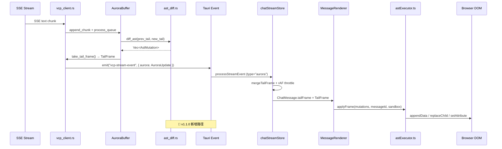
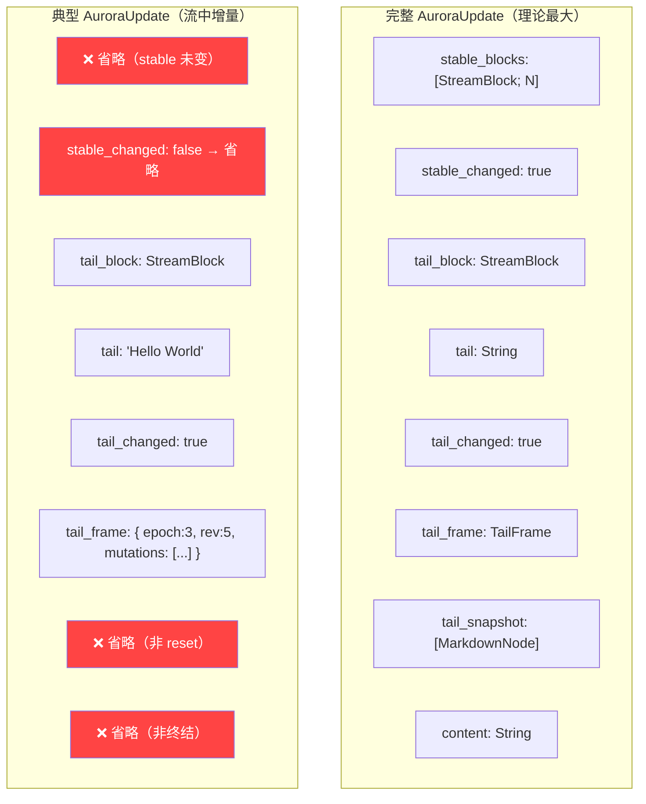
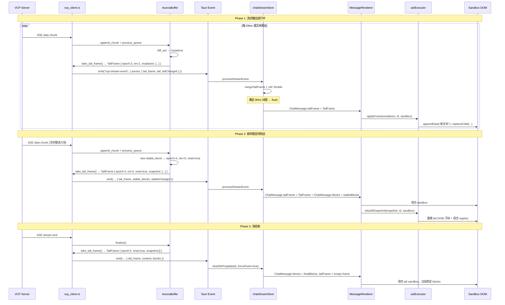

# 03_AstMutation 指令集与稀疏 IPC 协议

## 1. 概述

### 1.1 模块定位

AstMutation 指令集是 Rust 后端与 Vue 3 前端之间的**通用协议（Contract / Wire Protocol）**。它定义了 9 种最小粒度的 DOM 操作指令，Rust 侧通过 `diff_ast()` 产生，前端通过 `astExecutor.ts` 执行。

这套协议的三大设计目标：

1. **最小化 IPC 载荷**：只传输变化的部分，而非完整的 HTML 字符串
2. **确定性寻址**：每条指令通过路径 ID 精确指向目标 DOM 节点
3. **前端无状态解析**：前端不需要理解 Markdown，只需"机械地"执行指令

### 1.2 从 SSE 到 DOM 的完整链路



---

## 2. AstMutation —— 9 种突变指令

### 2.1 指令总览

定义于 `ast_diff.rs:4-35`，Rust 侧：

```rust
#[derive(Debug, Serialize, Deserialize, Clone, PartialEq)]
#[serde(tag = "op")]
pub enum AstMutation {
    Add { id, parent, node: MarkdownNode },                    // op="add"
    AddInline { id, parent, node: InlineNode },                // op="add_inline"
    AddListItem { id, parent, children: Vec<MarkdownNode> },   // op="add_list_item"
    UpdateText { id, value: String },                          // op="text"
    AppendText { id, chunk: String },                          // op="append"
    UpdateProp { id, key, value: String },                     // op="prop"
    Replace { id, node: MarkdownNode },                        // op="replace"
    ReplaceInline { id, node: InlineNode },                    // op="replace_inline"
    Remove { id },                                             // op="remove"
}
```

TypeScript 镜像（`chat.ts:126-134`）：

```typescript
export type AstMutation =
  | { op: "add"; id: string; parent: string; node: MarkdownNode }
  | { op: "add_inline"; id: string; parent: string; node: InlineNode }
  | { op: "add_list_item"; id: string; parent: string; children: MarkdownNode[] }
  | { op: "text"; id: string; value: string }
  | { op: "append"; id: string; chunk: string }
  | { op: "prop"; id: string; key: string; value: string }
  | { op: "replace"; id: string; node: MarkdownNode }
  | { op: "replace_inline"; id: string; node: InlineNode }
  | { op: "remove"; id: string };
```

> **Serde 标签映射**：Rust 的 `#[serde(rename = "...")]` 确保 `UpdateText` → `"text"`、`AppendText` → `"append"`、`UpdateProp` → `"prop"`，与 TS 侧的 `op` 字段完全一致。

### 2.2 AppendText —— 热路径之星

```rust
AppendText { id: String, chunk: String }
```

| 属性 | 值 |
|------|-----|
| 在流式场景中的占比 | **~60-70%** 的突变是 AppendText |
| 触发条件 | 新 Text 值以旧 Text 值为前缀（`strip_prefix`） |
| 前端执行 | `textNode.appendData(chunk)` —— 零 DOM 重排 |
| 典型载荷 | `{"op":"append","id":"t0.i0","chunk":" 新增的文本"}` |
| 设计考量 | 不能简单地在父节点下加 TextNode（会累积大量碎片节点） |

**为什么 AppendText 比 Add(Text) + Remove 更优**：

| 方案 | 操作 | DOM 影响 |
|------|------|---------|
| ❌ Add + Remove | 删除旧 TextNode → 创建新 TextNode → appendChild | 触发 reflow |
| ✅ AppendText | `textNode.appendData(chunk)` | 原地修改，0 reflow |

### 2.3 UpdateText —— 全量文本替换

```rust
UpdateText { id: String, value: String }
```

| 属性 | 值 |
|------|-----|
| 在流式场景中的占比 | ~5-10% |
| 触发条件 | 新 Text 值不以旧值为前缀（非单调增长） |
| 前端执行 | `node.textContent = value` |
| 典型场景 | Agent 在流式中修改了前面已输出的文本，或 Markdown 解析导致文本结构重组 |

> `UpdateText` 和 `AppendText` 是互斥的——`diff_text_node` 中通过 `strip_prefix` 自动选择最优路径。

### 2.4 Add / AddInline —— 新增节点

```rust
Add { id: String, parent: String, node: MarkdownNode }
AddInline { id: String, parent: String, node: InlineNode }
```

| 属性 | 值 |
|------|-----|
| 触发条件 | 新 AST 在尾部有旧 AST 中不存在的节点 |
| `parent` 取值 | `"root"`（挂载到 sandbox）或父节点的路径 ID（如 `"t0"`, `"t0.i0"`) |
| 前端执行 | `createDomFromNode(node, id, registry)` → `parentNode.appendChild(dom)` |
| CSS 动画 | 新增元素自动添加 `vcp-stream-element-fade-in` 类 |

### 2.4b AddListItem —— 新增列表项

```rust
AddListItem { id: String, parent: String, children: Vec<MarkdownNode> }
```

| 属性 | 值 |
|------|-----|
| 语义 | 新增一个列表项 (`<li>`)。列表项是「多个块级节点」的集合（`Vec<MarkdownNode>`），无法用 Add 的单一 `MarkdownNode` 表达，故单列一个变体 |
| `id` 取值 | `<li>` 路径 ID（如 `"t3.li5"`） |
| `parent` 取值 | 列表 `<ul>`/`<ol>` 的 ID（如 `"t3"`） |
| 触发条件 | 流式列表新增尾部项时（见 02 文档的 List diff）。删除列表项则复用通用 `Remove { id: "t3.li5" }` |
| 前端执行 | `astExecutor.ts` 的 `"add_list_item"` case：在存活的 `<ul>`/`<ol>` 下创建 `<li>`，按 `{id}.b{n}` 注册其块级子节点，追加到列表末尾 |

> **取代旧行为**：这取代了过去「列表项数量变化就整体 Replace 整个 list」的低效行为（O(n²) 重建）。现在新增尾部项只产生一条 AddListItem，已有列表项的 DOM 与 registry 完全保留。

### 2.5 Replace / ReplaceInline —— 节点替换

```rust
Replace { id: String, node: MarkdownNode }
ReplaceInline { id: String, node: InlineNode }
```

| 属性 | 值 |
|------|-----|
| 触发条件 | 类型相同但内容差异过大无法增量表达（如代码块内容全部重写、表格数据变化） |
| 前端策略 | **四级替换策略**（见 04 文档 §5），根据节点类型自动选择最优方式 |
| 典型载荷 | `{"op":"replace","id":"t0","node":{"type":"paragraph","children":[...]}}` |

**前端的四级替换决策树**：

```
Replace 节点类型?
  ├─ code_block → 策略 A: 原地 innerHTML 覆盖（保留 pre 外壳）
  ├─ mermaid   → 策略 B: 原地 textContent 覆盖（保留 placeholder）
  ├─ raw_html / table → 策略 C: morphdom 局部 DOM diff（保留媒体状态）
  └─ default   → 策略 D: createDomFromNode + replaceChild
```

> **策略 C 的 registry 一致性**：块级 `raw_html`/`table` 始终是「整节点全替换」，从不做子节点级 diff。因此 morphdom 执行后，注册表只保留**根 ID**（映射回页面上存活的 `oldNode`，而非被 morphdom 丢弃的临时 `newDom`），其余后代条目一律清除。后代条目不可从临时 registry 的后代节点取用——那些节点可能已被 morphdom 抛弃。行内容器（link/strong/emphasis 等）的 registry 重建规则更复杂（需在 morphdom 前后对路径求值），详见 04 文档 §5。

### 2.6 Remove —— 节点删除

```rust
Remove { id: String }
```

| 属性 | 值 |
|------|-----|
| 触发条件 | 旧 AST 尾部有新 AST 中不存在的节点 |
| 前端执行 | `parentNode.removeChild(node)` + `cleanupSubtreeRefs(id)` |
| 典型场景 | Tail 内容收缩（如 Agent 删除了未完成的段落） |

### 2.7 UpdateProp —— 属性变更

```rust
UpdateProp { id: String, key: String, value: String }
```

| 属性 | 值 |
|------|-----|
| 触发条件 | 节点类型相同但属性值变化（目前仅 Heading level 变化触发） |
| 前端执行 | 对 `level` 属性：创建新 `<hN>` 元素 + replaceChild；对其它属性：`setAttribute(key, value)` |

---

## 3. TailFrame —— 帧信封

### 3.1 结构定义

定义于 `aurora_pipeline.rs:10-22`：

```rust
pub struct TailFrame {
    pub epoch: u64,          // 纪元编号
    pub revision: u64,       // 纪元内修订号
    pub frame_seq: u64,      // 全局单调帧序号（前端去重用）
    #[serde(default, skip_serializing_if = "is_false")]
    pub reset: bool,         // 是否为 epoch 重置帧
    #[serde(skip_serializing_if = "Option::is_none")]
    pub snapshot: Option<Vec<MarkdownNode>>,  // reset 时的全量 AST 快照
    #[serde(default, skip_serializing_if = "Vec::is_empty")]
    pub mutations: Vec<AstMutation>,           // 增量突变指令
}
```

### 3.2 帧的三种形态

| 帧类型 | reset | snapshot | mutations | 前端行为 |
|--------|:-----:|:--------:|:---------:|---------|
| **增量帧** | false | None | 非空 | `applyFrame(mutations)` → 逐条执行 |
| **重置帧** | true | Some(nodes) | 空 | 清空 sandbox → `rebuildSnapshot(snapshot)` |
| **清空帧** | true | Some([]) | 空 | 清空 sandbox（finalize 时发送） |

### 3.3 frame_seq 去重

```rust
// aurora_pipeline.rs:110
self.tail_frame_seq = self.tail_frame_seq.saturating_add(1);
```

前端使用 `lastAppliedFrameSeq` 跟踪已应用的最后一帧序号：

```typescript
// MessageRenderer.vue:820-822
if (frame.frameSeq <= lastAppliedFrameSeq) {
    return;  // 已应用或乱序帧，直接跳过
}
```

这防止了以下情况：
- **重复帧**：如果 rAF 合并导致同一帧被多次触发
- **乱序帧**：如果网络延迟导致旧帧在新帧之后到达

### 3.4 reset 与 mutations 的互斥关系

当 `reset=true` 时，`mutations` **强制为空**：
```rust
// aurora_pipeline.rs:117
mutations: if reset { Vec::new() } else { mutations },
```

设计原因：epoch 重置意味着 DOM 需要全量重建，在已清空的 sandbox 上执行增量 mutations 无意义。

---

## 4. AuroraUpdate —— 顶层 IPC 事件

### 4.1 结构定义

定义于 `aurora_pipeline.rs:26-50`：

```rust
pub struct AuroraUpdate {
    #[serde(skip_serializing_if = "Option::is_none")]
    pub stable_blocks: Option<Vec<StreamBlock>>,   // 仅 stable_changed 时发送
    #[serde(default, skip_serializing_if = "is_false")]
    pub stable_changed: bool,

    #[serde(skip_serializing_if = "Option::is_none")]
    pub tail_block: Option<StreamBlock>,            // 仅 tail_changed 时发送
    #[serde(skip_serializing_if = "Option::is_none")]
    pub tail: Option<String>,
    #[serde(default, skip_serializing_if = "is_false")]
    pub tail_changed: bool,

    #[serde(skip_serializing_if = "Option::is_none")]
    pub tail_frame: Option<TailFrame>,              // 🆕 v1.1.0 增量帧
    #[serde(skip_serializing_if = "Option::is_none")]
    pub tail_snapshot: Option<Vec<MarkdownNode>>,    // 🆕 非帧恢复兜底

    #[serde(skip_serializing_if = "Option::is_none")]
    pub content: Option<String>,                    // 仅 stream end 时发送
}
```

### 4.2 稀疏序列化策略

AuroraUpdate 使用**大量 `skip_serializing_if`** 来实现稀疏序列化——只传输变化的字段，减少 IPC 载荷：



**典型载荷大小对比**：

| 场景 | v1.0.3 AuroraUpdate | v1.1.0 AuroraUpdate | 缩减比 |
|------|---------------------|---------------------|:------:|
| 流中增量（tail 200 chars） | ~1.5KB（含完整 HTML tail） | ~300 bytes（稀疏 TailFrame） | **~80%** |
| 稳定块到达 | ~4KB（含完整 HTML blocks） | ~800 bytes（AST blocks + TailFrame reset） | **~80%** |
| 流结束 | ~8KB（含完整 content） | ~8KB（content 相同） | 持平 |
| 空帧（tail 未变） | ~100 bytes | 0 bytes（不发送 tail_frame） | **100%** |

### 4.3 前端接收与合并

在 `chatStreamStore.ts` 中，`type === "aurora"` 事件的处理流程：

```typescript
// chatStreamStore.ts:338-441 (简化)
if (type === "aurora") {
    const aurora = event.aurora;
    let update = rAFPendingUpdates.get(actualMessageId);

    // 稀疏合并：只覆盖有值字段
    if (aurora.content !== undefined) update.content = aurora.content;
    if (aurora.stableChanged) update.blocks = aurora.stableBlocks;
    if (aurora.tailFrame) {
        update.tailFrame = mergeTailFrame(update.tailFrame, aurora.tailFrame);
    }
    if (aurora.tailChanged) {
        update.tailContent = aurora.tail;
        update.tailBlock = aurora.tailBlock;
    }

    // rAF 30Hz 节流
    if (update.animationFrameId === null) {
        update.animationFrameId = requestAnimationFrame(runRenderLoop);
    }
}
```

**`mergeTailFrame` 合并策略**（`chatStreamStore.ts:43-62`）：

```typescript
function mergeTailFrame(existing, incoming) {
    if (!existing || incoming.reset || incoming.epoch !== existing.epoch) {
        // Epoch 不同或首次或 reset → 替换整个帧
        return { ...incoming, mutations: incoming.reset ? [] : [...incomingMutations] };
    }
    // 同 Epoch → 合并 mutations
    return {
        ...incoming,
        mutations: [...existing.mutations, ...incomingMutations],
    };
}
```

> **合并的意义**：在高频 SSE 流中，两个 AuroraUpdate 可能在同一个 rAF 间隔内到达。mergeTailFrame 将它们合并为一个帧，减少 Vue 响应式触发次数和 DOM 操作批次。

---

## 5. 完整 IPC 生命周期



---

## 6. 与相关协议的关系

| 协议/模块 | 层级 | 说明 |
|----------|------|------|
| `StreamBlock` SSR | Rust → Frontend | 稳定块的结构化传输（含 AST 预渲染），流式期间使用 |
| `ContentBlock` SSR | Rust → Frontend | 消息完全渲染后的最终块（非流式），历史消息加载使用 |
| **`AstMutation`** | Rust → Frontend | **v1.1.0 新增**——流式 tail 的增量 DOM 指令 |
| **`TailFrame`** | Rust → Frontend | **v1.1.0 新增**——单次 Diff 结果的帧封装 |
| **`AuroraUpdate`** | Rust → Frontend | **v1.1.0 重构**——Aurora 事件的稀疏容器，同时容纳 stable/tail/frame |
| `vcp-stream-event` | Tauri Event | Tauri 的 SSE 事件通道，`type` 字段区分 `"aurora"`/`"chunk"`/`"end"` 等 |

---

*文档基于 `src-tauri/src/vcp_modules/chat/ast_diff.rs`（AstMutation enum）、`src-tauri/src/vcp_modules/chat/aurora_pipeline.rs`（TailFrame + AuroraUpdate）及 `src/core/types/chat.ts`（TypeScript 镜像类型）的源码分析生成。*
