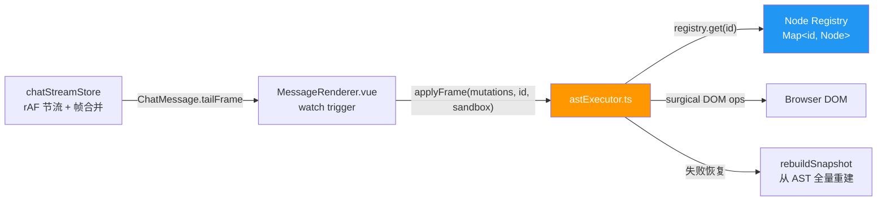
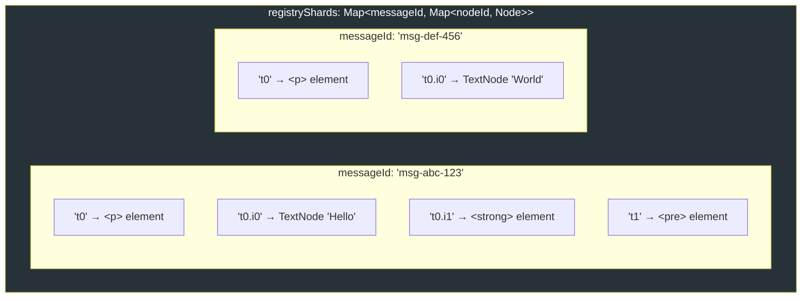
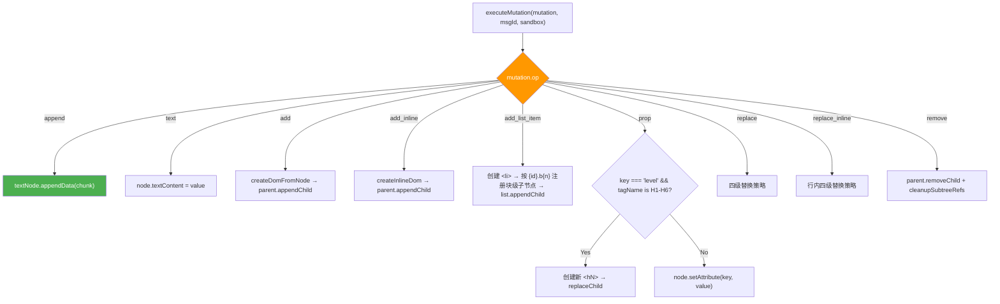
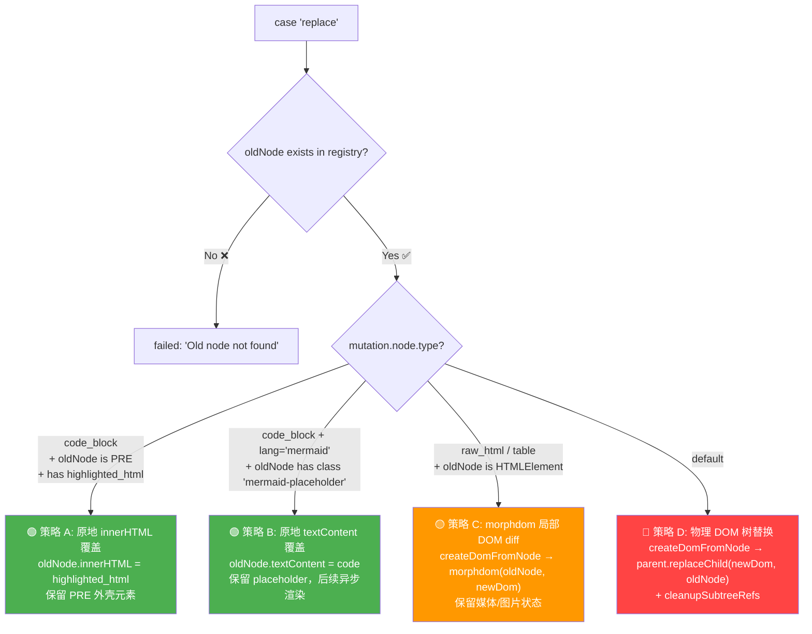

# 04_前端 AstExecutor DOM 外科引擎

## 1. 概述

### 1.1 模块定位

`astExecutor.ts` 是 AST Diff 渲染引擎的**前端执行层**——它接收 Rust 后端产出的 `AstMutation[]` 指令集，通过一个**分片化的 Node Registry（节点注册表）**精准定位目标 DOM 节点，执行**手术级别的 DOM 操作**。

与 `astRenderer.ts` 的关系：

| 模块 | 输入 | 输出 | 使用场景 |
|------|------|------|---------|
| **astExecutor.ts** | `AstMutation[]` + `messageId` + `sandbox` | 手术级 DOM 变更 | AST Diff 启用的流式 tail 渲染 |
| **astRenderer.ts** | `MarkdownNode[]` + `messageId` | HTML 字符串 | 稳定块的批量渲染 / AST Diff 禁用时的降级路径 |

### 1.2 与其他模块的关系



---

## 2. Node Registry —— 节点注册表

### 2.1 分片设计

```typescript
// astExecutor.ts:79
const registryShards = new Map<string, Map<string, Node>>();
//                            ↑ messageId     ↑ nodeId → DOM Node
```

采用**两层 Map（Per-Message Sharding）**设计：

- **第一层**：按 `messageId` 分片，每个消息维护独立的节点注册表
- **第二层**：`nodeId` → `Node` 的映射，精确查找



**为什么需要分片**：
- **内存隔离**：`cleanupRegistry(messageId)` 只释放指定消息的全部 DOM 引用，不影响其他消息的活跃节点
- **并发安全**：多消息同时流式输出时，各自的 Node Registry 互不干扰
- **性能**：每个消息的节点数通常 < 200，Map 查找 O(1)

### 2.2 生命周期管理

```typescript
// astExecutor.ts:99-106
function getRegistry(messageId: string): Map<string, Node> {
    let shard = registryShards.get(messageId);
    if (!shard) {
        shard = new Map();
        registryShards.set(messageId, shard);
    }
    return shard;
}

// astExecutor.ts:112-122
export function cleanupRegistry(messageId: string): void {
    const registry = registryShards.get(messageId);
    const size = registry ? registry.size : 0;
    registryShards.delete(messageId);  // 释放整个分片
    recordAstTrace({ type: "cleanup_registry", messageId, registrySizeReleased: size });
}
```

调用时机：
- `MessageRenderer.vue` **onUnmounted**：组件卸载时清理
- Sandbox **变化**时（新消息或 bubble 切换）：旧 sandbox 的注册表失效
- Epoch **重置**时：全量重建前先清空旧注册表

### 2.3 子树引用清理

```typescript
// astExecutor.ts:127-133
function cleanupSubtreeRefs(prefix: string, registry: Map<string, Node>, includeSelf = false): void {
    for (const key of registry.keys()) {
        if ((includeSelf && key === prefix) || key.startsWith(prefix + ".")) {
            registry.delete(key);  // 递归删除前缀匹配的子孙节点引用
        }
    }
}
```

当节点被 Replace 或 Remove 时，其所有子孙节点的注册表条目必须一并清除，防止**幽灵引用（Dangling References）**——注册表中指向已脱离 DOM 树的节点。

---

## 3. DOM 构造器 —— createDomFromNode

### 3.1 块级节点 → DOM 映射表

定义于 `astExecutor.ts:171-320`：

| AST 节点类型 | DOM 元素 | 子节点前缀 | 特殊处理 |
|-------------|----------|-----------|---------|
| `paragraph` | `<p>` | `{id}.i{N}` | 遍历 children 递归 createInlineDom |
| `heading` | `<h{n}>` (n=level) | `{id}.i{N}` | 同上 |
| `code_block`（`lang="mermaid"`） | `<div class="mermaid-placeholder">` | — | textContent 赋值为源码（不渲染 `<pre>`） |
| `code_block`（其他 lang） | `<pre class="vcp-code-block vcp-scrollable">` | — | highlighted_html 去嵌套 + innerHTML 赋值 |
| `blockquote` | `<blockquote>` | `{id}.b{N}` | 递归 createDomFromNode |
| `list` | `<ol>` 或 `<ul>` | `{id}.li{N}.b{M}` | 每个 item→`<li>`，内部递归 |
| `table` | `<div>` > `<table>` > `<thead>` + `<tbody>` | `{id}.th{N}.i{M}` / `{id}.tr{N}.td{M}.i{K}` | 三级嵌套结构 |
| `thematic_break` | `<hr>` | — | 无子节点 |
| `raw_html` | `<div class="vcp-raw-html-container">` | — | 经过 repairHtmlFragment 修复后 innerHTML |
| 默认 | `<div>` | — | 兜底 |

> Mermaid 没有独立的节点类型，是 `code_block` 内 `node.lang === "mermaid"` 的分支。

### 3.2 行内节点 → DOM 映射表

定义于 `astExecutor.ts` 的 `createInlineDom`：

| AST 节点类型 | DOM 元素/节点 | 特殊处理 |
|-------------|-------------|---------|
| `text` | `TextNode` | `document.createTextNode(value)` |
| `strong` | `<strong>` | 递归 createInlineDom children |
| `emphasis` | `<em>` | 同上 |
| `strikethrough` | `<del>` | 同上 |
| `code` | `<code>` | textContent 赋值 |
| `link` | `<a target="_blank" rel="noopener noreferrer">` | `needs_asset_conversion` 时通过 `convertFileSrc` 转换 href |
| `image` | `` | 同上 src 转换 |
| `break` | `<br>` | 软/硬换行统一为 `break` |
| `inline_math` | `<span class="vcp-math-inline/block no-swipe">` | `data-latex` 属性保存原始公式 |
| `vcp_custom` | `<span class="vcp-custom-{kind}">` | 有 children 递归渲染；否则 textContent 赋为 `value`。`kind` 取 `quote`/`highlight`/`alert` |
| `raw_html_inline` | `<span>` | 经过 repairHtmlFragment 修复后 innerHTML |

### 3.3 元素注册

每个 `createDomFromNode` 和 `createInlineDom` 在创建 DOM 节点的**同时**将其注册到 Registry：

```typescript
// astExecutor.ts:318
registry.set(id, el);
// astExecutor.ts:450
registry.set(id, el);
```

这意味着创建 DOM 后，后续的任何 `executeMutation` 都可以通过 `registry.get(nodeId)` 直接找到目标节点。

---

## 4. applyFrame() —— 批量帧执行

### 4.1 执行流程

```typescript
// astExecutor.ts:801-846
export function applyFrame(
    mutations: AstMutation[],
    messageId: string,
    sandbox: HTMLElement
): ApplyFrameResult {
    let result: ApplyFrameResult = { ok: true, applied: 0 };

    for (const [index, mutation] of mutations.entries()) {
        const mutationResult = executeMutation(mutation, messageId, sandbox);
        if (!mutationResult.ok) {
            // 🛑 第一条失败的 mutation 处立即停止
            result = {
                ok: false, applied: index,
                failed: { index, mutation, reason: mutationResult.reason }
            };
            break;
        }
        result.applied += 1;
    }
    return result;
}
```

**关键设计**：一旦某条 mutation 执行失败，**立即停止**后续所有 mutations。这是有意为之的**防雪崩机制**——如果某个节点注册表已损坏，继续执行后续 mutations 只会累积错误，立即停止并触发 snapshot 重建是更安全的策略。

### 4.2 ApplyFrameResult 结构

```typescript
export type ApplyFrameResult = {
    ok: boolean;
    applied: number;
    failed?: {
        index: number;       // 失败 mutation 在数组中的位置
        mutation: AstMutation;  // 失败的 mutation 内容
        reason: string;         // 失败原因
    };
};
```

---

## 5. executeMutation() —— 手术级突变执行

### 5.1 总览决策树



### 5.2 AppendText —— 零 reflow 追加

```typescript
case "append": {
    const node = registry.get(mutation.id);
    if (node && node.nodeType === Node.TEXT_NODE) {
        (node as CharacterData).appendData(mutation.chunk);
    } else {
        status = "failed";
        detail = node ? `Node type is not text (${node.nodeType})` : "Node not found in registry";
    }
    break;
}
```

**安全校验**：
- ✅ `node` 存在 → 继续
- ✅ `node.nodeType === Node.TEXT_NODE` → 可以安全使用 `CharacterData.appendData()`
- ❌ 否则 → 返回失败，触发 snapshot 重建

### 5.3 Add / AddInline —— 新节点挂载

```typescript
case "add": {
    const parentNode = mutation.parent === "root"
        ? sandbox                          // 根级节点挂载到 sandbox
        : registry.get(mutation.parent);    // 子级节点通过 registry 找父节点
    if (parentNode) {
        const newDom = createDomFromNode(mutation.node, mutation.id, registry);
        if (newDom instanceof HTMLElement) {
            newDom.classList.add("vcp-stream-element-fade-in");  // CSS 淡入动画
        }
        parentNode.appendChild(newDom);
    }
}
```

新增元素自动添加 `vcp-stream-element-fade-in` CSS 类，触发淡入动画（通过 UnoCSS 的 `animate-fade-in` 实现），让新出现的文本/元素有柔和的视觉过渡。

### 5.4 Replace —— 四级替换策略（块级节点）

这是 `executeMutation` 中最复杂的部分 （`astExecutor.ts:576-668`），根据被替换节点的类型选择最优策略：



#### 策略 A：CodeBlock 原地 innerHTML

```typescript
if (nodeType === "code_block" && oldNode instanceof HTMLElement &&
    oldNode.tagName === "PRE" && mutation.node.highlighted_html) {
    cleanupSubtreeRefs(mutation.id, registry, false);  // 清除子节点引用，保留 PRE 外壳
    // 去嵌套包裹...
    oldNode.innerHTML = html;  // 原地覆盖，不销毁 PRE 元素
    break;
}
```

**关键优化**：CodeBlock 的 AST 节点载荷中包含 `highlighted_html`（syntect 预渲染的 HTML），直接赋值给 `<pre>` 的 `innerHTML` 即可，无需重建整个代码块 DOM。

#### 策略 B：Mermaid 原地 textContent

Mermaid 是 `lang === "mermaid"` 的 `code_block`（无独立节点类型）：

```typescript
if (nodeType === "code_block" && mutation.node.lang === "mermaid" &&
    oldNode instanceof HTMLElement &&
    oldNode.classList.contains("mermaid-placeholder")) {
    cleanupSubtreeRefs(mutation.id, registry, false);
    oldNode.textContent = mutation.node.code || "";
    break;
}
```

保留 Mermaid placeholder 元素，后续由异步渲染管线（`renderHeavyContent()`）通过 `mermaid.run()` 将源码渲染为 SVG。

#### 策略 C：RawHtml / Table morphdom

```typescript
if ((nodeType === "raw_html" || nodeType === "table") && oldNode instanceof HTMLElement) {
    const tempRegistry = new Map<string, Node>();
    const newDom = createDomFromNode(mutation.node, mutation.id, tempRegistry);

    morphdom(oldNode, newDom, {
        childrenOnly: false,
        onBeforeElUpdated: (fromEl, toEl) => {
            if (fromEl.isEqualNode(toEl)) return false;  // 完全相同，跳过
            if (fromEl.tagName === 'IMG' && (fromEl as HTMLImageElement).complete) return false;  // 已加载的图片不重建
            if (fromEl.tagName === 'VIDEO' || fromEl.tagName === 'AUDIO') {
                if (!(fromEl as HTMLMediaElement).paused) return false;  // 正在播放的媒体不重建
            }
            return true;
        }
    });

    cleanupSubtreeRefs(mutation.id, registry, true);
    registry.set(mutation.id, oldNode);  // 仅保留根 ID → 存活 DOM；子孙引用全部清空
    break;
}
```

**为什么用 morphdom 而不是直接 innerHTML？**
- **媒体状态保持**：`` 已完成加载的不重建，`<video>`/`<audio>` 正在播放的不中断
- **表格滚动位置**：用户横向滚动的表格位置不被 innerHTML 重置
- **最小化 DOM 操作**：morphdom 内部也只变更实际变化的节点

> **⚠️ 不可采用 tempRegistry 的子孙引用**（已修复的隐患）：morphdom 会把 `oldNode` 原地变形为 `newDom` 的结构，过程中复用部分旧节点、丢弃部分 `newDom` 临时节点。因此 `tempRegistry` 里记录的子孙节点引用可能指向已被丢弃的临时 DOM。
> - **block 级 `raw_html` / `table`**：它们永远整体 Replace、绝不对子树做增量 child diff，所以**只保留根 ID（指向存活的 `oldNode`）、清空全部子孙引用**即可（`registry.set(mutation.id, oldNode)`）。
> - **inline 容器节点**（`link`/`strong`/`emphasis`/`strikethrough`/`vcp_custom`）会被后续 `.i{N}` 子级 mutation 继续增量更新，必须**从 morphdom 后存活的真实 DOM 子树重建子孙 registry**（见 §5.5）。

#### 策略 D：默认物理替换

```typescript
// 默认兜底
cleanupSubtreeRefs(mutation.id, registry, true);
const newDom = createDomFromNode(mutation.node, mutation.id, registry);
if (newDom instanceof HTMLElement) {
    newDom.classList.add("vcp-stream-element-fade-in");
}
parent.replaceChild(newDom, oldNode);
```

最彻底的替换方式——完全销毁旧 DOM 树并创建新树。开销最大但在语义上永远正确。

### 5.5 ReplaceInline —— 行内节点四级替换策略

行内替换同样采用分级策略（`astExecutor.ts` 的 `replace_inline` case）：

| 策略 | 节点类型 | 操作 |
|:----:|---------|------|
| **A** | `text`（TextNode） | `oldNode.textContent = value` |
| **A** | `code`（`<code>`） | `oldNode.textContent = value` |
| **A** | `inline_math` | `oldNode.setAttribute("data-latex", ...)` + `textContent` |
| **A** | `vcp_custom`（无 children，即 `highlight`/`alert` 叶子型） | `oldNode.textContent = value` |
| **B** | `image`（``） | 原地更新 `src`/`alt`/`title` 属性 |
| **C** | `link`, `vcp_custom`(含 children，如 `quote`)、`strong`, `emphasis`, `strikethrough`, `raw_html_inline` | morphdom 局部 DOM diff |
| **D** | 其他 | `createInlineDom → parent.replaceChild` |

> **策略 C 的 registry 子孙重建**（已修复隐患）：`link`/`strong`/`emphasis`/`strikethrough`/`vcp_custom` 会被后续 `.i{N}` 子级 mutation 继续更新，故 morphdom 后必须重建子孙 registry，否则后续子级 mutation 会命中被 morphdom 丢弃的临时节点而**静默失败**。做法：
> 1. **morphdom 之前**，先记录 `tempRegistry` 中每个子孙 id 相对 `newDom` 的 `childNodes` 索引路径（必须在变形前算，因变形会移走/丢弃 `newDom` 子节点）。
> 2. morphdom 执行（保证 `oldNode` 变形后结构与 `newDom` 一致）。
> 3. **morphdom 之后**，根 ID 指向存活的 `oldNode`；对每个子孙 id，沿其索引路径从 `oldNode` 子树下行取回真实存活节点写回 registry。
>
> `raw_html_inline` 无 AST children，直接只保留根、清空子孙（无需路径重建）。

### 5.6 Remove —— 安全删除

```typescript
case "remove": {
    const node = registry.get(mutation.id);
    if (node && node.parentNode) {
        node.parentNode.removeChild(node);
        cleanupSubtreeRefs(mutation.id, registry, true);  // 级联清理子孙引用
    }
}
```

### 5.7 UpdateProp —— 属性变更

```typescript
case "prop": {
    const node = registry.get(mutation.id);
    if (node instanceof HTMLElement) {
        if (mutation.key === "level" && /^H[1-6]$/i.test(node.tagName)) {
            // 标题级别变更：创建新元素 → 复制内容 → replaceChild
            const replacement = document.createElement(`h${level}`);
            replacement.innerHTML = node.innerHTML;
            // 复制 attributes...
            registry.set(mutation.id, replacement);  // 更新注册表
            node.parentNode.replaceChild(replacement, node);
        } else {
            node.setAttribute(mutation.key, mutation.value);
        }
    }
}
```

---

## 6. repairHtmlFragment() —— HTML 断口修复

### 6.1 问题描述

在流式输出中，HTML 标签可能被 SSE 分块边界切断：

```
Chunk N:   '<div class="card" <'
Chunk N+1: 'div>...</div>'
```

如果直接将这个残缺 HTML 赋值给 `innerHTML`，部分 WebView 的解析器会因无法定位标签边界而**直接丢弃整个内容**。

### 6.2 修复策略（已修正语义）

> **⚠️ 修正历史**：旧实现对**整串**统计引号奇偶并补全，会把正文文本里合法出现的奇数个引号误补一个尾引号。新实现把引号判定**严格限定在「最后一个未闭合标签片段」内部**，正文引号永不受影响。

```typescript
function repairHtmlFragment(html: string): string {
    if (!html) return "";

    // 仅当最后一个 '<' 之后再无 '>'，才存在未闭合标签断口；否则原样返回（不再碰正文引号）
    const lastOpenAngle = html.lastIndexOf("<");
    const lastCloseAngle = html.lastIndexOf(">");
    if (lastOpenAngle <= lastCloseAngle) return html;

    const head = html.slice(0, lastOpenAngle);
    const fragment = html.slice(lastOpenAngle);

    // 非真实标签起始（正文里的孤立 '<'）：丢弃该断口片段
    if (!/^<\/?[a-zA-Z]/.test(fragment)) return head;

    // 仅在该未闭合标签片段内部判断属性引号是否成对（忽略转义引号）
    // ...统计 fragment 内的 " 与 ' ...
    const quotesBalanced = /* 双/单引号均成对 */;

    // 引号成对（属性已完整，仅缺 '>'）→ 补 '>' 当帧即可渲染（长 HTML 容器尽早显示）
    // 引号失衡（卡在属性值中途，如 '` : head;
}
```

核心语义：
1. **作用域收敛**：只检查最后一个未闭合标签片段（`lastIndexOf("<")` 之后无 `>`），绝不再扫描整串。
2. **成对则补 `>`**：属性引号成对说明标签结构完整、仅缺收尾，补 `>` 让它当帧渲染，体感上长 HTML 容器更早可见。
3. **失衡则截断**：引号失衡（正卡在某个属性值中途）无法安全补全，丢弃该未闭合标签，待下一帧 chunk 完整后渲染。

> 这是一种**有损修复**（截断了最后一个不完整标签），但比 WebView 直接丢弃整个内容要好得多。被截断的内容在下一帧会随新的 SSE chunk 得到完整渲染，且永不污染前文正文。

---

## 7. rebuildSnapshot() —— 全量快照重建

### 7.1 功能

```typescript
// astExecutor.ts:457-477
export function rebuildSnapshot(
    nodes: MarkdownNode[] | undefined,
    messageId: string,
    sandbox: HTMLElement
): void {
    sandbox.innerHTML = "";         // 1. 清空沙箱
    cleanupRegistry(messageId);     // 2. 释放旧注册表
    const registry = getRegistry(messageId);  // 3. 新建注册表分片
    for (const [index, node] of (nodes || []).entries()) {
        const dom = createDomFromNode(node, `t${index}`, registry);
        sandbox.appendChild(dom);
    }
}
```

### 7.2 触发场景

| 场景 | 调用者 |
|------|--------|
| Epoch 重置（新稳定块 / tail 清空） | `MessageRenderer.vue` watch 中的 reset 路径 |
| Mutation 执行失败 | `handleAstFrameFailure()` |
| Sandbox 变更（新消息） | `MessageRenderer.vue` watch 中的 sandbox 变化检测 |

### 7.3 错误恢复与保活设计

```typescript
// MessageRenderer.vue:98-113
function handleAstFrameFailure(sandbox: HTMLElement, reason: string): void {
    astFailureCount += 1;
    if (getTailSnapshotNodes().length > 0) {
        rebuildTailSnapshot(sandbox);
        // 【意图性设计说明】：直接 return，不执行关闭降级逻辑。
        // 在流式输出过程中，宁可重建 snapshot 也不彻底降级到 innerHTML，
        // 因为降级会导致流式组件切换、DOM 物理销毁重建和严重的布局抖动。
        return;
    }
    if (astFailureCount >= 2) {
        // 连续两次失败且无 snapshot 可用 → 彻底禁用 AST Diff
        enableAstDiff.value = false;
        cleanupRegistry(props.message.id);
    }
}
```

**保活策略优先级**：
1. 🟢 **首选**：snapshot 重建（从完整 AST 重建 DOM，reset Registry）
2. 🟡 **次选**：连续 2 次失败且无 snapshot → 禁用 AST Diff，降级到 innerHTML
3. 🔴 **避免**：不轻易降级——降级后 DOM 全量重建会导致输入框焦点丢失和视觉闪烁

---

## 8. astRenderer.ts —— HTML 降级路径

### 8.1 功能

当 AST Diff 被禁用（`enableAstDiff.value = false`）或渲染稳定块时，`astRenderer.ts` 将 `MarkdownNode[]` 转换为 HTML 字符串：

```typescript
export function renderMarkdownNodes(
    nodes: MarkdownNode[],
    messageId: string,
    blockHash?: string | number
): string {
    // 带 LRU 保护的 HTML 缓存
    const key = getCacheKey(messageId, blockHash);
    if (key && htmlCache.has(key)) return htmlCache.get(key);

    const html = nodes.map(node => renderNode(node, messageId)).join('');

    if (key) {
        if (htmlCache.size >= MAX_CACHE_SIZE) htmlCache.clear();
        htmlCache.set(key, html);
    }
    return html;
}
```

### 8.2 Hash 缓存机制

- **缓存 Key**：`${messageId}:${blockHash}`
- **MAX_CACHE_SIZE** = 500 条
- **LRU 近似**：超过上限时清空全部缓存（而非逐条淘汰，简化实现）
- **缓存命中模式**：同一消息的同一 block（hash 相同）在多次渲染中命中

### 8.3 节点渲染函数

包含完整的 `renderNode`（MarkdownNode → HTML string）和 `renderInline`（InlineNode → HTML string），与 `createDomFromNode`/`createInlineDom` 形成对称但独立的两套实现——一套面向 DOM 操作，一套面向字符串拼接。

---

## 9. 调试追踪体系

### 9.1 功能开关

```typescript
// 在浏览器 DevTools Console 中执行：
window.__VCP_AST_DEBUG__ = true;  // 开启 AST 调试日志
```

### 9.2 追踪数据

```typescript
window.__VCP_AST_TRACES__  // 所有 mutation / frame_done / cleanup 事件的时间线
window.__VCP_ANALYZE_AST_TRACES__()  // 打印统计面板
```

统计面板包含：
- 帧渲染次数（applyFrame 调用次数）
- 突变总指令数（executeMutation 调用次数）
- 缓存销毁次数（cleanupRegistry 调用次数）
- 运行健康度（失败突变占比）
- 每帧的 Registry 节点数走势
- 失败突变的详细负载

---

*文档基于 `src/core/utils/astExecutor.ts`（~847行）及 `src/core/utils/astRenderer.ts`（~184行）的源码分析生成。*
