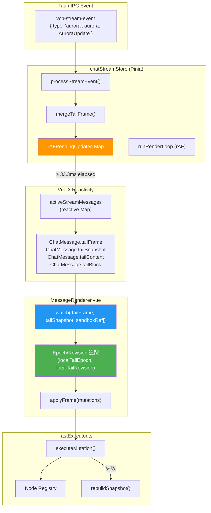
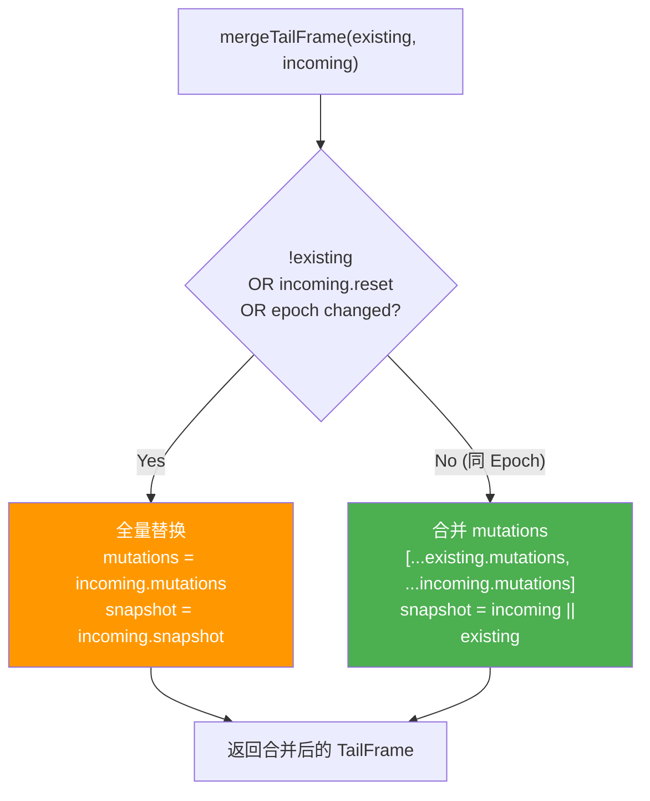
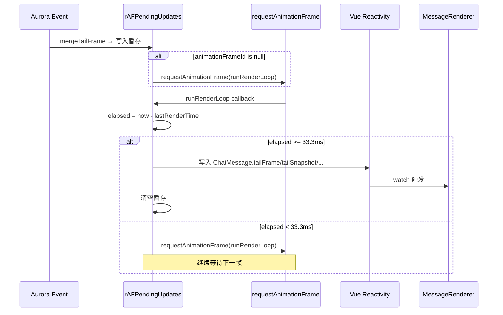
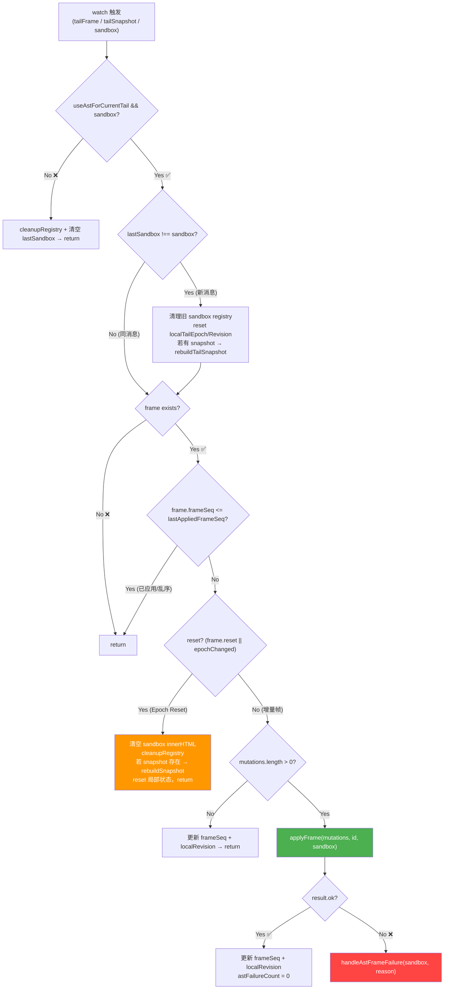
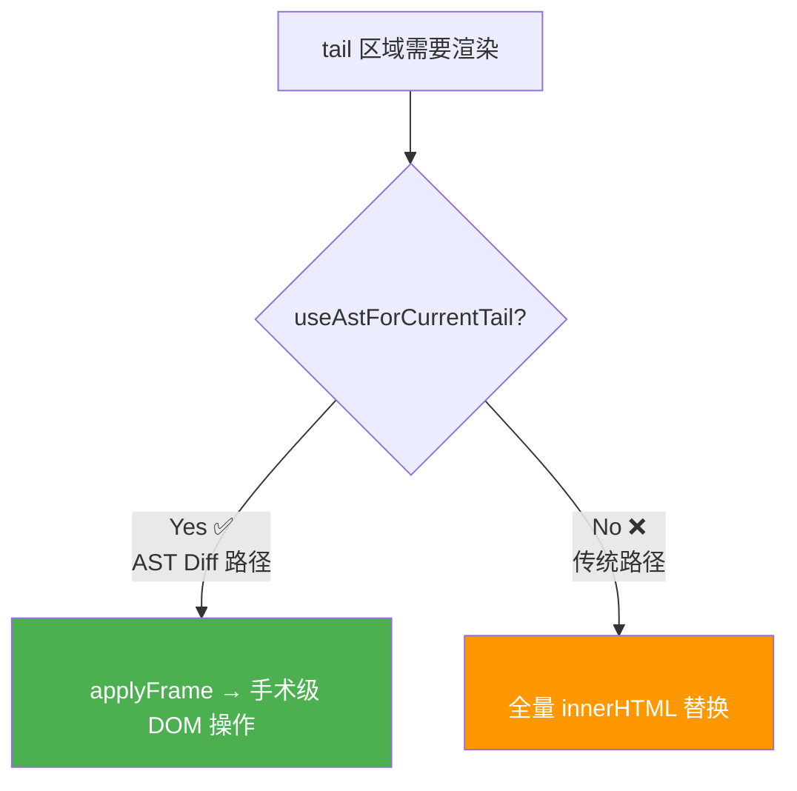

# 05_MessageRenderer 集成与 rAF 渲染节流

## 1. 概述

### 1.1 模块定位

本章覆盖 AST Diff 引擎与 Vue 3 渲染管线的**集成层**，由两个关键模块组成：

| 模块 | 职责 | 文件行数 |
|------|------|:------:|
| **chatStreamStore.ts** | rAF 30Hz 帧合并、mergeTailFrame、AuroraUpdate 稀疏写入 | ~443 行（相关部分） |
| **MessageRenderer.vue** | watch 三源监听、Epoch 追踪、applyFrame 调度、错误恢复 | ~870 行（相关部分） |

### 1.2 集成架构概览



---

## 2. chatStreamStore —— rAF 帧合并与 30Hz 节流

### 2.1 为什么需要节流

SSE 流可以以任意频率到达（通常每 50-100ms 一个 chunk），但 DOM 渲染不需要匹配这个频率：

- **60Hz 渲染**（每 16.7ms 一次）：移动端功耗高，人眼无法感知文本流的 60fps
- **30Hz 渲染**（每 33.3ms 一次）：视觉上足够流畅，功耗降低 ~40%
- **无节流**：高频 SSE → 高频 Vue 响应式 → 高频 DOM 操作 → CPU 飙升 → UI 卡顿

### 2.2 rAFPendingUpdates 暂存池

```typescript
// chatStreamStore.ts:68-78
const rAFPendingUpdates = new Map<string, {
    content: string | null;
    blocks: any[] | null;
    tailContent: string | null;
    tailBlock: any | null;
    tailFrame: TailFrame | null;
    tailSnapshot: any[] | null;
    animationFrameId: number | null;
    lastRenderTime: number;
}>();
const MIN_RENDER_INTERVAL_MS = 33.3;  // 30Hz 上限
```

每个流式消息在 `rAFPendingUpdates` 中维护一个**暂存条目**。当 Aurora 事件到达时，数据先写入暂存池，不直接触发 Vue 响应式更新。

### 2.3 Aurora 事件写入暂存池

```typescript
// chatStreamStore.ts:382-402 (简化)
if (aurora.tailFrame) {
    // 帧合并：同一 epoch 内合并 mutations，不同 epoch 或 reset 时替换
    update.tailFrame = mergeTailFrame(update.tailFrame, aurora.tailFrame);
    if (aurora.tailFrame.snapshot) {
        update.tailSnapshot = aurora.tailFrame.snapshot;
    }
}
if (aurora.tailChanged) {
    update.tailContent = aurora.tail || "";
    update.tailBlock = aurora.tailBlock || null;
}
if (aurora.stableChanged && aurora.stableBlocks) {
    update.blocks = aurora.stableBlocks;
}
```

### 2.4 mergeTailFrame() —— 帧合并策略

```typescript
// chatStreamStore.ts:43-62
function mergeTailFrame(existing: TailFrame | null, incoming: TailFrame): TailFrame {
    const incomingMutations = incoming.mutations || [];
    if (!existing || incoming.reset || incoming.epoch !== existing.epoch) {
        // 首次、reset 或 Epoch 变更 → 全量替换
        return {
            ...incoming,
            mutations: incoming.reset ? [] : [...incomingMutations],
            snapshot: incoming.snapshot ? [...incoming.snapshot] : undefined,
        };
    }

    // 同 Epoch 内 → 合并 mutations 数组
    return {
        ...incoming,
        reset: existing.reset || incoming.reset,
        snapshot: incoming.snapshot || existing.snapshot,
        mutations: [
            ...(existing.reset ? [] : existing.mutations || []),
            ...incomingMutations,  // 拼接新旧 mutations
        ],
    };
}
```



> **为什么合并 mutations 数组？** 在同一个 33ms rAF 窗口内可能收到 2-3 个 Aurora 事件，每个携带少量 mutations。将它们合并为一个数组一次性执行，减少了 Vue 响应式触发次数和 DOM 操作批次，提高了效率。

### 2.5 rAF 渲染循环

```typescript
// chatStreamStore.ts:406-441 (简化)
const runRenderLoop = () => {
    const up = rAFPendingUpdates.get(actualMessageId);
    if (!up) return;

    const now = performance.now();
    const elapsed = now - up.lastRenderTime;

    if (elapsed >= MIN_RENDER_INTERVAL_MS) {
        // 满足 30Hz 间隔 → 写入 Vue 响应式
        const m = activeStreamMessages.get(actualMessageId);
        if (m) {
            if (up.content !== null) m.content = up.content;
            if (up.blocks !== null) m.blocks = up.blocks;
            if (up.tailSnapshot !== null) m.tailSnapshot = up.tailSnapshot;
            if (up.tailFrame !== null) m.tailFrame = up.tailFrame;
            if (up.tailContent !== null) m.tailContent = up.tailContent;
            if (up.tailBlock !== undefined) m.tailBlock = up.tailBlock;
        }
        up.lastRenderTime = now;
        // 清空暂存
        up.content = null; up.blocks = null; up.tailContent = null;
        up.tailBlock = null; up.tailFrame = null; up.tailSnapshot = null;
        up.animationFrameId = null;
    } else {
        // 未到 30Hz 门槛 → 在下一帧继续尝试
        up.animationFrameId = requestAnimationFrame(runRenderLoop);
    }
};
```



### 2.6 clearRAFUpdate() —— 流结束的强制刷新

```typescript
// chatStreamStore.ts:83-103
const clearRAFUpdate = (messageId: string, forceFlush = false) => {
    const up = rAFPendingUpdates.get(messageId);
    if (up) {
        if (up.animationFrameId !== null) {
            cancelAnimationFrame(up.animationFrameId);  // 取消等待中的 rAF
        }
        if (forceFlush) {
            // 强制同步刷新：确保所有暂存数据写入 Vue 响应式
            const msg = activeStreamMessages.get(messageId);
            if (msg) {
                if (up.content !== null) msg.content = up.content;
                if (up.blocks !== null) msg.blocks = up.blocks;
                if (up.tailContent !== null) msg.tailContent = up.tailContent;
                if (up.tailBlock !== undefined) msg.tailBlock = up.tailBlock;
                if (up.tailSnapshot !== null) msg.tailSnapshot = up.tailSnapshot;
                if (up.tailFrame !== null) msg.tailFrame = up.tailFrame;
            }
        }
        rAFPendingUpdates.delete(messageId);  // 释放暂存池条目
    }
};
```

在 `type === "end"` 或 `type === "error"` 时调用 `clearRAFUpdate(id, true)`，确保**不丢失最后一个 rAF 窗口内的暂存数据**。

---

## 3. MessageRenderer.vue —— Watch 集成

### 3.1 Feature Flag 与计算属性

```typescript
// MessageRenderer.vue:74-81
const enableAstDiff = ref(true);  // Feature Flag

const useAstForCurrentTail = computed(() => {
    return enableAstDiff.value && (
        !!props.message.tailFrame ||
        !!props.message.tailBlock?.nodes ||
        !!props.message.tailSnapshot
    );
});
```

`useAstForCurrentTail` 决定当前消息的 tail 渲染走**AST Diff 路径**还是**传统 innerHTML 路径**。

### 3.2 本地状态追踪

```typescript
// MessageRenderer.vue:82-85
let lastAppliedFrameSeq = 0;  // 已应用的最后一帧序号（去重用）
let localTailEpoch = -1;      // 本地追踪的 Epoch（用于 reset 检测）
let localTailRevision = -1;   // 本地追踪的 Revision
let astFailureCount = 0;      // 连续失败计数器
let lastSandbox: HTMLElement | null = null;  // 上一条消息的 sandbox 引用
```

这些变量**不是 Vue ref**（不需要触发重渲染），而是通过闭包在 watch 回调中维护的 mutable state。

### 3.3 Watch 三源监听

```typescript
// MessageRenderer.vue:785-862
watch(
    [
        () => props.message.tailFrame,      // 源 1: 增量帧
        () => props.message.tailSnapshot,    // 源 2: 快照 AST
        tailSandboxRef,                       // 源 3: DOM 容器
    ],
    ([frame, _snapshot, sandbox]) => {
        // ...
    },
    { flush: "post", immediate: true }  // DOM 更新后触发，立即执行
);
```

`flush: "post"` 确保 watch 回调在 Vue 完成 DOM patch 之后执行，此时 `tailSandboxRef` 已经指向真实的 DOM 元素。

### 3.4 Watch 执行流程



### 3.5 Epoch Reset 处理

```typescript
// MessageRenderer.vue:826-841
const incomingEpoch = frame.epoch ?? 0;
const epochChanged = incomingEpoch !== localTailEpoch;
const explicitReset = frame.reset === true || epochChanged;

if (explicitReset) {
    sandbox.innerHTML = '';           // 清空 DOM
    cleanupRegistry(props.message.id); // 释放注册表
    localTailEpoch = incomingEpoch;
    localTailRevision = incomingRevision;
    lastAppliedFrameSeq = frame.frameSeq;
    astFailureCount = 0;

    const snapshot = frame.snapshot || getTailSnapshotNodes();
    if (snapshot.length > 0) {
        rebuildSnapshot(snapshot, props.message.id, sandbox);
    }
    return;  // reset 帧不执行 mutations
}
```

### 3.6 正常增量帧处理

```typescript
// MessageRenderer.vue:844-858
const mutations = frame.mutations || [];
if (mutations.length === 0) {
    lastAppliedFrameSeq = frame.frameSeq;
    localTailRevision = incomingRevision;
    return;
}

const result = applyFrame(mutations, props.message.id, sandbox);
if (result.ok) {
    lastAppliedFrameSeq = frame.frameSeq;
    localTailRevision = incomingRevision;
    astFailureCount = 0;  // 成功 → 重置失败计数
} else {
    handleAstFrameFailure(sandbox, result.failed?.reason || "applyFrame failed");
}
```

### 3.7 错误恢复策略

```typescript
// MessageRenderer.vue:98-113
function handleAstFrameFailure(sandbox: HTMLElement, reason: string): void {
    astFailureCount += 1;

    if (getTailSnapshotNodes().length > 0) {
        // ✅ 有 snapshot → 全量重建（保活）
        rebuildTailSnapshot(sandbox);
        return;  // 【意图性】不降级，保持 AST Diff 路径
    }

    if (astFailureCount >= 2) {
        // ❌ 连续 2 次失败且无 snapshot → 彻底降级
        enableAstDiff.value = false;
        cleanupRegistry(props.message.id);
    }
}
```

**保活 vs 降级**决策矩阵：

| 条件 | 行为 | 后果 |
|------|------|------|
| 单次失败 + 有 snapshot | 全量 snapshot 重建 | AST Diff 继续，DOM 短暂重建 |
| 单次失败 + 无 snapshot | 记录失败，等待下一帧 | 可能自我修复（如下一帧的 reset） |
| 连续 2 次失败 + 有 snapshot | 全量 snapshot 重建 | 同上 |
| 连续 2 次失败 + 无 snapshot | **彻底降级到 innerHTML** | 流式组件切换 → DOM 全量重建 → 可能闪烁 |

> **设计意图**：降级到 innerHTML 是**最后手段**。因为降级会导致前端从 AST Diff 路径切换到传统 innerHTML 路径，中间涉及组件销毁/重建、DOM 全量替换、布局抖动和输入框焦点丢失。AST Diff 的 `rebuildSnapshot` 重建虽然也是全量操作，但保持在同一个渲染路径内，不涉及组件层级的切换。

---

## 4. 双路径渲染策略

### 4.1 两种渲染路径



对应的模板代码（`MessageRenderer.vue:947-954`）：

```html
<!-- AST Diff 路径：空白 sandbox，由 watch 中的 applyFrame 填充 -->
<div v-if="useAstForCurrentTail && isPlainBlock(message.tailBlock.type)"
     ref="tailSandboxRef"
     class="vcp-tail-sandbox">
</div>

<!-- 传统路径：v-html 全量渲染 -->
<div v-else-if="!useAstForCurrentTail && isPlainBlock(message.tailBlock.type)"
     v-html="renderMarkdownNodes(tailNodes, message.id)">
</div>
```

### 4.2 路径切换条件

| 条件 | 走哪条路径 | 说明 |
|------|:--------:|------|
| AST Diff 启用 + tailFrame/tailBlock.nodes/tailSnapshot 存在 | AST Diff 路径 | 正常流式输出 |
| AST Diff 被禁用（`enableAstDiff = false`） | 传统路径 | 错误降级后 |
| Tail block 不是 plain 类型（如 thought/html-preview） | 传统路径 | 非纯文本块必须用 v-html |

### 4.3 消息气泡分裂（`<!--brk-->`）

v1.1.0 同时支持了 `<!--brk-->` 标记的消息气泡分裂功能，与 AST Diff 兼容：

```typescript
// MessageRenderer.vue:169-188
function splitMarkdownNodes(nodes: any[]): any[][] {
    const result: any[][] = [];
    let currentGroup: any[] = [];

    for (const node of nodes) {
        if (isBrkNode(node)) {
            if (currentGroup.length > 0) {
                result.push(currentGroup);
                currentGroup = [];  // 遇到 <!--brk--> → 开始新气泡
            }
        } else {
            currentGroup.push(node);
        }
    }
    if (currentGroup.length > 0) result.push(currentGroup);
    return result;
}
```

一个 AI 回复可以被 `<!--brk-->` 分割为多个独立的聊天气泡。分裂在 `messageBubbles` computed 中进行，完全独立于 AST Diff 路径，两者可以共存。

---

## 5. 双端调试追踪体系

### 5.1 Rust 端

Rust 侧使用标准 `log` crate 输出 AST 相关日志：

```
[PreRender] parse_markdown_to_ast panicked: ...
[AST Diff] diff_ast: old_len=3 new_len=4 mutations=2
```

### 5.2 前端 AST 追踪（astExecutor.ts）

```javascript
// 浏览器 Console 中启用
window.__VCP_AST_DEBUG__ = true;

// 查看追踪数据
window.__VCP_AST_TRACES__;
// [
//   { type: "mutation", op: "append", mutationId: "t0.i0", ... },
//   { type: "frame_done", messageId: "msg-123", mutationsCount: 5, ... },
//   { type: "cleanup_registry", messageId: "msg-123", registrySizeReleased: 45 },
// ]

// 打印统计面板
window.__VCP_ANALYZE_AST_TRACES__();
// 📊 录制统计面板
// - 帧渲染次数 (applyFrame): 42 次
// - 突变总指令数: 287 条
// - 缓存销毁次数: 3 次
// - 运行健康度: 100% (所有突变成功执行！)
```

### 5.3 前端流追踪（chatStreamStore.ts）

```javascript
// 浏览器 Console 中启用
window.__VCP_STREAM_DEBUG__ = true;

// 查看追踪数据
window.__VCP_STREAM_TRACES__;
// [
//   { messageId: "msg-123", auroraPayload: { stableChanged, tailFrame: { epoch, mutationsCount, ... } }, ... },
// ]
```

### 5.4 调试信息的层级

| 层级 | 开关 | 信息类型 |
|------|------|---------|
| Rust 后端 | `log` crate (默认) | 解析 panic、diff 结果统计 |
| chatStreamStore | `__VCP_STREAM_DEBUG__` | Aurora 事件到达时序、帧合并状态 |
| astExecutor | `__VCP_AST_DEBUG__` | 每个 mutation 的执行结果、帧完成状态 |
| astExecutor 分析 | `__VCP_ANALYZE_AST_TRACES__()` | 聚合统计分析、健康度面板 |

---

## 6. onUnmounted 清理

```typescript
// MessageRenderer.vue:864-867
onUnmounted(() => {
    removeScopedCss(props.message.id);    // 清理动态注入的 scoped style
    cleanupRegistry(props.message.id);    // 释放该消息的 Node Registry 分片
});
```

每个消息组件卸载时，必须释放其 Node Registry 分片和动态样式注入，防止内存泄漏和样式污染。

---

## 7. 性能总结

### 7.1 各层级的开销对比

| 操作 | 传统路径 (v1.0.x) | AST Diff 路径 (v1.1.0) |
|------|:---:|:---:|
| Rust: diff_ast 计算 | — | 0.01 - 0.5ms |
| IPC: TailFrame 传输 | ~2-8KB HTML | ~200-800 bytes JSON |
| Store: rAF 合并 | — | 0 额外开销（利用引擎自有 rAF） |
| Vue: watch 响应式 | 触发 v-html 更新 | 触发 applyFrame（不更新 v-html） |
| DOM: 节点操作 | `innerHTML =`（全量 parse + layout） | `appendData` / `replaceChild`（手术级） |
| 单帧总耗时 | 20-50ms | 0.5-3ms |

### 7.2 30Hz 节流的实际效果

在典型的 SSE 流式场景中（chunk 约每 50-100ms 到达一次），30Hz 节流意味着：
- 如果 chunk 到达频率 > 30Hz：自动降频到 30Hz，消除过度渲染
- 如果 chunk 到达频率 < 30Hz：rAF 在一帧内即可满足间隔条件，直接渲染
- 实际上绝大多数流式输出的 chunk 速率在 10-20Hz，**节流机制在大部分时间不生效**——它只在高频 burst 场景提供保护

---

*文档基于 `src/features/chat/MessageRenderer.vue`（watch 逻辑，~870行相关）及 `src/core/stores/chatStreamStore.ts`（rAF 节流，~443行相关）的源码分析生成。*
